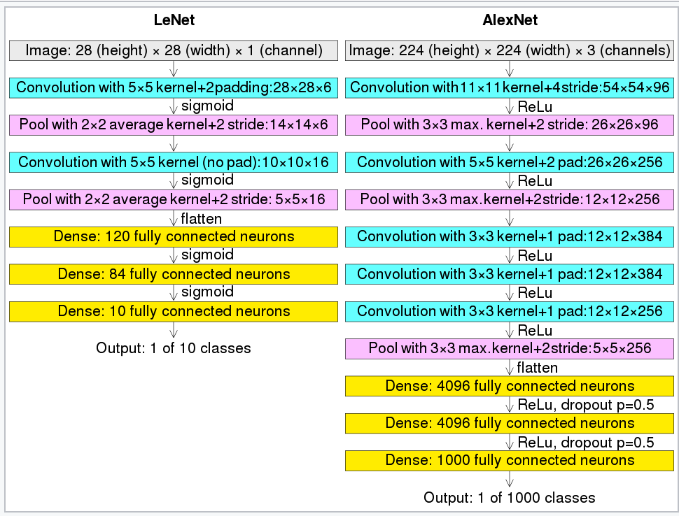

# AlexNet复现

## 网络结构

## 数据集

使用kaggle上的[stanford-dogs-dataset](https://www.kaggle.com/datasets/jessicali9530/stanford-dogs-dataset)进行训练

该数据集一共788MB，共120类，每一类平均200样本，理论上讲是比较少的，因此训练效果不一定能很好

## 代码构建log

- model.py中，构建了AlexNet网络和LeNet网络模型结构
- Train.py中，分别使用了AlexNet网络和LeNet网络进行了训练和测试，效果非常不好，准确率只能在1%附近浮动

## tips

之前的CIFAR 10 quick model模型中，使用的数据集中每一种分类的样本量能够达到10k左右，因此显然用这份数据集跑不出好结果的
