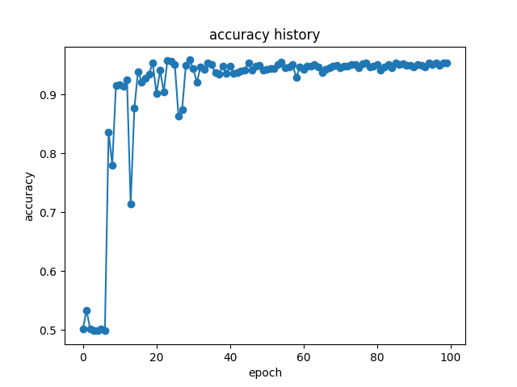
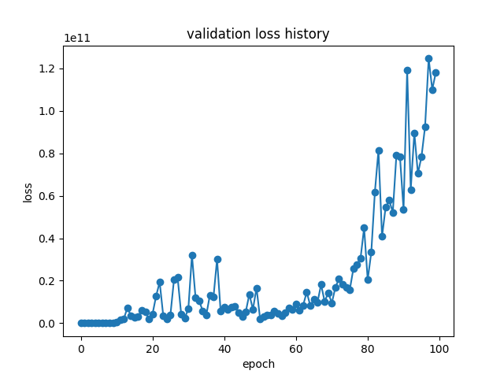

# CNN模型结果分析

## 初步训练效果展示

当训练参数如下时：

```python
    batch_size = 256
    epoch = 100
    learning_rate = 0.01
    optimer = Lion(model.parameters(), lr=learning_rate)
```

模型效果如下（这里的Accuracy是在测试集上的Accuracy）：






这结果带来几个问题值得研究

首先，为什么loss不和Accuracy一样稳定的变化，因为理论上讲loss应该稳定下降才对，到后面loss还越学越多了

其次，模型还能不能优化

对此我准备先做点其他的实验，比如拟合线性函数啥的

## 题外话（

看到一篇非常好的文章：
[知乎：深度学习的loss一般收敛到多少？](https://www.zhihu.com/question/435099359/answer/2457089939)

这篇文章中讲了几种validation loss和training loss的情况：

第一种叫做High Variance：


这意味着验证集上的误差与在训练集上的误差之间的差值很大，此时training loss很小，说明模型在训练集上能学到东西，而测试集误差很大，说明测试集对模型太难了，这就说明此时模型泛化能力差，过拟合。应该增强数据集，模型做regularization等。

第二种叫做High Bias：


此时发现随着size的增大，两个loss接近，且training loss很高，说明模型没学懂数据，是欠拟合。这种时候就应该换一个更好的模型更大的模型。

最后一种是Both，说明模型泛化能力又差又学不懂数据。


