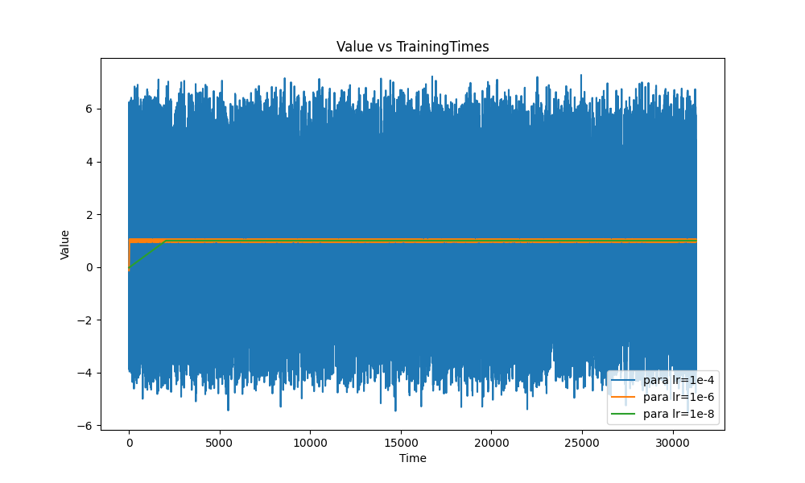

# 一个简单的深度学习demo：拟合线性回归

## 问题背景

在李沐大神《动手深度学习》一书的启发下构建了这个demo。

模型的目标是要构建一个线性回归模型，拟合下式中的所有参数$w_i=2^{i-1}$：

$$
y=\sum_{i=1}^n w_i\times x_i
$$

因此，我们定义训练数据为

$$
X_{(n\times 1)}=\begin{bmatrix}\vec{x_1} \\ \vec{x_2} \\ ... \\ \vec{x_n}\end{bmatrix}=\begin{bmatrix}(x_{11} & x_{12}&...&x_{1m} )\\...&...&...&...\\(x_{n1} & x_{n2}&...&x_{nm} )\end{bmatrix}
$$

模型参数为

$$
W_{(1\times n)}=\begin{bmatrix}\vec{w_1} \\ \vec{w_2} \\ ... \\ \vec{w_n}\end{bmatrix}^T=\begin{bmatrix}(w_{11} & w_{12}&...&w_{1m} )\\...&...&...&...\\(w_{n1} & w_{n2}&...&w_{nm}) \end{bmatrix}^T, where  \ w_{ij}=2^{j-1}
$$

待预测值为

$$
Y_{(n\times 1)}=Linear(X,W)=\begin{bmatrix}\vec{x_1}\cdot\vec{w_1} \\ ... \\ \vec{x_n}\cdot\vec{w_n}\end{bmatrix}=\begin{bmatrix}\sum_{i-1}^m w_{1i}\times x_{1i} \\ ... \\ \sum_{i-1}^m w_{ni}\times x_{ni} \end{bmatrix}
$$

使用一般的线性回归当然可以求出$W_{(1\times n)}$的解析解，但这里如果使用深度学习的方法去拟合，即使得不到解析解，并且速度也慢，但是由于问题背景非常简单，在实验过程中能解释很多深度学习中的问题。

## 问题解决

要构建深度学习模型来拟合上面的参数$W_{(1\times n)}$，只需要用一个$(n\times1)$的线性层就行了。模型结构非常简单：

```python
class LinerRegressionModel(nn.Module):
    def __init__(self, numOfInput):
        super().__init__()
        self.Linear = Linear(numOfInput, 1)

    def forward(self, data):
        return self.Linear(data)
```

这样定义，模型可以拟合如下的式子：

$$
y=(\sum_{i=1}^n w_i\times x_i) + bias
$$

此时使用如下参数进行训练：

```python
numOfX = 1  # 只有一个自变量，其对应的参数w是2的0次方，也就是1
numOfInstance = int(1e4)
batchSize = 32
numOfEpoch = 100
optim = SGD(model.parameters(), lr=0.000001)
loss = L1Loss()
```

得到如下的loss图像和参数值图像


## 现象分析

本实验最宝贵的价值就在于能解释很多现象。

### 为什么loss一直不能归0而在一个较大的值附近变动？

**问题:** 为什么在实验中，loss收敛后，一直在1200到1300之间波动，而没有像理想中的状态一样收敛到0？

讨论这个问题之前，我们先讨论loss的计算方法。

#### loss计算方法分析

在这个线性回归模型中，参数w一直在1附近变动，大概在0.9到1.1周围，偏置$bias$则在-2到2之间波动。

我们的loss函数是L1loss，其计算方式如下：

$$
L1loss=\frac{1}{n}\sum_{i=1}^n|y_i-\hat{y_i}|
$$

通过这种为预测值和实际值之间做差并且取平均值的方法计算的loss，直接反映了预测值和实际值之间的差距。

经过统计，在训练数据中的x的取值范围为$x\in[1, 100000]$，平均值为49462，总样本数量为$1e4$，batchSize为32，因此误差值有

$$
loss=\frac{1}{8}\sum_{i=1}^8|w_i\times x_i + bias- 1\times x_i|=\frac{1}{8}\sum_{i=1}^8|(w_i - 1)\times x_i + bias|
$$

其中，$(w_i - 1)\in(0.01, 0.1)$，$bias\in(-2, 2)$，使用x的平均值则可以估算出$loss\approx49981\times0.03=1499.43$，因此最后loss大概就在$10^3$左右变动。

通过上面的计算证明了算法计算loss的方式和我们想的一样。但是为什么参数w一直变动，大概在0.9到1.1周围，而不能更加精确？

这就需要提到梯度下降的原理。

#### 梯度下降分析

深度学习中参数的更新是由算法计算出的梯度和学习率二者决定的。

参数的更新公式可以表示为：

$$
w_{new} = w_{old} - \eta \cdot \frac{\partial L}{\partial w}
$$

其中，$w$ 和 $b$ 分别表示权重和偏置参数，$\eta$ 是学习率，$L$ 是损失函数，$\frac{\partial L}{\partial w}$ 是损失函数对权重的偏导数，这个偏导数就是我们所说的梯度。

因此可以发现，梯度和学习率的大小直接决定了参数更新的多少。为了验证这一点，我们截取了训练过程中的部分记录如下：

```plaintext
Batch1:
Layer: Linear.weight, Weight: 0.13758498430252075, Gradient: -48809.46875
Layer: Linear.bias, Weight: -0.03127705678343773, Gradient: -1.0
Batch2:
Layer: Linear.weight, Weight: 0.1886884570121765, Gradient: -51103.46875
Layer: Linear.bias, Weight: -0.03127605840563774, Gradient: -1.0
```

Batch1中的线性层的权重为$w=0.13758498430252075$，梯度为$grad=-48809.46875$，由于学习率为$lr=0.000001$，此时可以计算出接下来的新权重应该是$w_{new} = w-lr\times grad= 0.1886884570121765$，正好等于Batch2中的权重。

经过观察，梯度$grad$的取值范围基本就在$1e5$之间，因此为了让w的值精确到0.1，我们这里将学习率设置为了$lr=0.000001$才满足条件。因此可以知道，学习率越小，最后拟合出来的w就越精确，现在的参数w一直变动的原因就是因为当前的学习率只支持这个精度的参数，想要更加精确，则需要使用更小的学习率。我们使用了不同的学习率进行了实验，效果如下。



可以发现，学习率越低，参数越接近1，模型效果越好。
