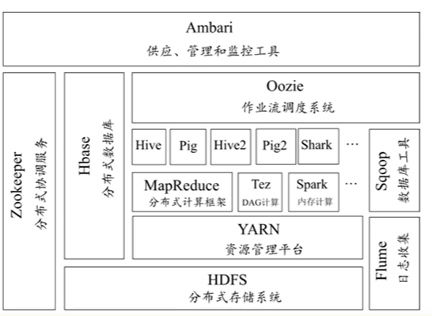
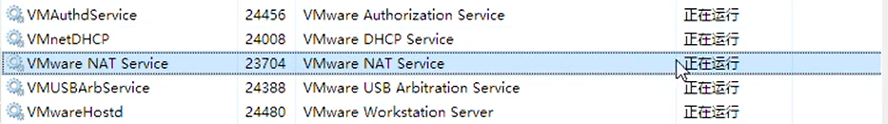
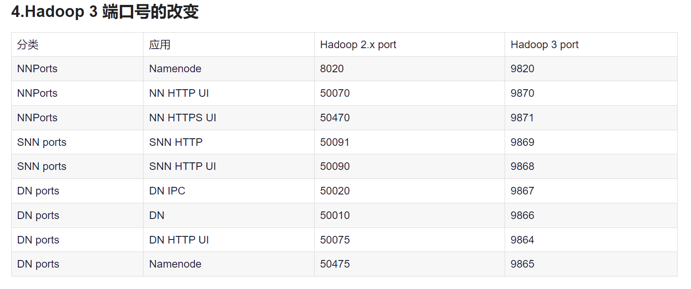
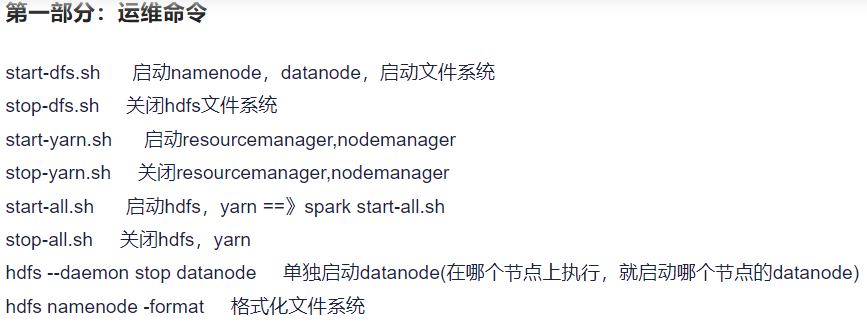

# Hadoop

## 1.1概述

Apache项目 据此产生hive zookeeper spark



HDFS：分布式文件系统

MapReduce：分布式计算框架，用于大量数据的并行运算

Yarn：用于资源管理和调度

Sqoop：数据迁移

Mahout：算法库

HBase：动态模式数据库，分布式

Zookeeper：分布式应用协调服务

Hive：将结构化的数据文件映射为数据表，将SQL转化为MapReduce任务运行 （基于Hadoop的数据仓库）

Flume：日志系统

## 2.1 Hadoop集群的构建

系统选择centos：1处理器2核心
内存4g 最大磁盘大小：50G
作basic server
用户名密码：root 123456 制作三个目录 mkdir -p export/data|servers|software

可以进行克隆虚拟机：右键-管理-克隆

## 2.2Liunx的系统网络配置



虚拟网络编辑器更改设置：子网IP，DHCP

windows设置：设置为确定的ip地址

 ```
 设置主机名 vi /etc/sysconfig/network
 HOSTNAME=hadoop01
 配置ip映射
 vi /etc/hosts
 192.168.121.134 hadoop01
 192.168.121.135 hadoop02
 192.168.121.136 hadoop03
 
 网络参数设置
 mac地址
 /etc/udev/rules.d/70-xxxx???
 
 配置静态IP地址
 /etc/sysconfig/network-scripts/ifcfg-ens
 
 BOOTPROTO=static
 
 IPADDR=
 NETMASK=
 GATEWAY=
 DNS1=
 效果验证
 重启后ifconfig ,ping ,
 
 #ssh配置
 rpm -qa | grep ssh
 ps -e | grep sshd
 
 #ssh免密登录
 ssh-keygen -t rsa//生成公私钥
 #第二步
 三台机器将公钥到第一台机器
 ssh-copy-id hadoop01
 
 scp /root/.ssh/authorized_keys hadoop02:/root/.ssh
 scp /root/.ssh/authorized_keys hadoop03:/root/.ssh Hadoop
 ```

## 2.3Hadoop搭建

完全分布式：主节点，从节点

#### JDK安装

```shell
tar -zxvf jdk-8u391-linux-x64.tar.gz -C /export/servers/
cd /export/servers
mv jdk1.8.0_391 jdk

#配置JDK环境变量
vi /etc/profile
#添加内容
export JAVA_HOME=/export/servers/jdk
export PATH=$PATH:$JAVA_HOME/bin
export CLASSPATH=.:$JAVA_HOME/lib/dt.jar:$JAVA_HOME/lib/tools.jar

echo '# java环境
export JAVA_HOME=/usr/java/jdk1.8.0_221
export CLASSPATH=$JAVA_HOME/lib/
export PATH=$PATH:$JAVA_HOME/bin'>> /etc/profile

source /etc/profile

java -version
```

### Hadoop安装

```shell
cd /export/software
tar -zxvf hadoop-3.3.6.tar.gz -C /export/servers/

export HADOOP_HOME=/export/servers/hadoop-3.3.6
export PATH=:$HADOOP_HOME/bin:$HADOOP_HOME/sbin:$PATH

source /etc/profile
```

#### Hadoop 集群配置


```shell
#hadoop-env.sh
export JAVA_HOME=/export/servers/jdk

#core-site.xml
<configuration>
        <property>
                <name>fs.defaultFS</name>
                <value>hdfs://hadoop01:9000</value>
        </property>
        <property>
                <name>hadoop.tmp.dir</name>
                <value>/export/servers/hadoop-3.3.6</value>
        </property>
</configuration>

#hdfs-site.xml
<configuration>
	<property>
    	<name>dfs.replication</name>
    	<value>3</value>
	</property>
	<property>
    	<name>dfs.namenode.secondary.http-address</name>
        <value>hadoop02:50090</value>
	</property>
</configuration>

#mapred-site.xml
<configuration>
	<property>
    	<name>mapreduce.framework.name</name>
    	<value>yarn</value>
	</property>
</configuration>

#yarn-site.xml
<configuration>
<property>
    <name>yarn.resourcemanager.hostname</name>
    <value>hadoop01</value>
</property>

<property>
    <name>yarn.nodemanager.aux-services</name>
    <value>mapreduce_shuffle</value>
</property>
</configuration>

#slaves
hadoop01
hadoop02
hadoop03

#分发配置文件
scp /etc/profile  hadoop02:/etc/profile
scp /etc/profile  hadoop03:/etc/profile
scp -r /export/  hadoop02:/
scp -r /export/  hadoop03:/

#在0203上source
```

## 2.4HDFS

```shell
hdfsnamenode -format
hadoop namenode -format

#common.Storage: Storage directory /export/servers/hadoop-3.3.6/dfs/name has been successfully formatted.
```

```shell
#启动HDFS和YARN
#主节点
hadoop-daemon.sh start namenode
#每个节点
hadoop-daemon.sh start datanode
#检查
jps

yarn-daemon.sh start resourcemanager
yarn-daemon.sh start nodemanager

jps

#secondary脚本
hadoop-daemon.sh start secondarynamenode

#关闭变为stop

systemctl stop firewalld

#最直接启动
start-all.sh
```








```shell
#处理案例

hadoop fs -mkdir -p /wordcount/input
hadoop fs -put /export/data/word.txt  /wordcount/input
/share/hadoop/mapreduce
(-f 覆盖)
hadoop jar hadoop-mapreduce-examples-3.3.6.jar wordcount /wordcount/input /wordcount/output
```

