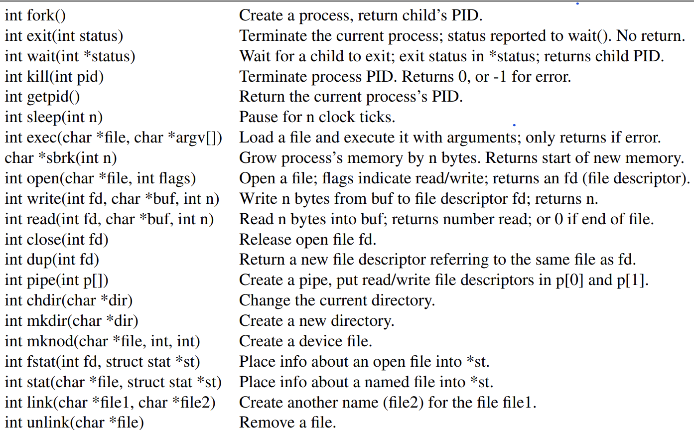

# **LEC 1 (ab):** [Introduction](https://pdos.csail.mit.edu/6.828/2021/slides/6s081-lec-intro.pdf) and [examples](https://pdos.csail.mit.edu/6.828/2021/lec/l-overview/)

(handouts: [xv6 book](https://pdos.csail.mit.edu/6.828/2021/xv6/book-riscv-rev2.pdf); 2020: [notes](https://pdos.csail.mit.edu/6.828/2021/lec/l-overview.txt), [video](https://youtu.be/L6YqHxYHa7A))

**Preparation**: [Read chapter 1](https://pdos.csail.mit.edu/6.828/2021/xv6/book-riscv-rev2.pdf) (for your amusement: [Unix](https://www.youtube.com/watch?v=tc4ROCJYbm0))
**Homework 1 due:** [Question](https://pdos.csail.mit.edu/6.828/2021/homework/q.html)
**Assignment**: [Lab util: Unix utilities](https://pdos.csail.mit.edu/6.828/2021/labs/util.html)


# Notes

Why Hard/Interesting ?

+ unforgiving
+ tensions
+ + Efficient Abstract
  + powerful simple
  + Flexible Secure

### system call

#### xv6 : simple Unix

risc-v qemu machine


# After Class

## Chapter 1 : Operating system interfaces

An operating system manages and abstracts the low-level hardware.

for a application, different hardware,one environment.
for applications ,run at the same time while occupy the whole environment(as it appears),share data or work together.

Since system calls have privileges, supposed to separate user and kernel space.

### 1.1 Processes and memory

fork 
return 0 in the new process
return new process PID in the original process



exec  format input ELF  : two arguments > filename and array of string arguments.

+ for shell use on behalf of user 

main (shell) :
getcmd > fork > wait (child run) >child exit?

### 1.2 I/O and File descriptors

file descriptor represent a kernel-managed object. 
make anything look like streams of bytes. 
在内部，xv6 内核使用文件描述符作为每个进程表的索引，因此
每个进程都有一个从零开始的文件描述符的私有空间

fd (0:input  1:output 2:error)

read(fd,buf,n) offset 

write(fd,buf,n)

File descriptors and fork interact to make I/O redirection easy to implement. Fork copies the parent’s file descriptor table along with its memory, so that the child starts with exactly the same open files as the parent. The system call exec replaces the calling process’s memory but preserves its file table.

Now it should be clear why it is helpful that fork and exec are separate calls: between the two, the shell has a chance to redirect the child’s I/O without disturbing the I/O setup of the main 14 shell.

fork()将父进程的全部资源传递给子进程

1. 使用fork()函数创建子进程时，子进程和父进程有各自独立的进程地址空间，fork后会重新申请一份资源，包括进程描述符、进程上下文、进程堆栈、内存信息、打开的文件描述符、进程优先级、根目录、资源限制、控制终端等，拷贝给子进程。
2. fork函数会返回两次，一次在父进程，另一次在子进程，如果返回值为0，说明是子进程；如果返回值为正数，说明是父进程

### 1.3 Pipes

buffer for processes to interact

**fork()执行流**：
when `if(fork()==0)`  execute ,fork() - > parent fork a child process.
if() - >parent execute 

```c
int p[2];
char *argv[2];
argv[0] = "wc";
argv[1] = 0;
pipe(p);
if(fork() == 0) {
	close(0);
	dup(p[0]);
	close(p[0]);
	close(p[1]);
	exec("/bin/wc", argv);
} else {
	write(p[1], "hello world\n", 12);
	close(p[0]);
	close(p[1]);
}
```

pipe() create a pipe and record descriptors in p[2];
child close its descriptor 0 then dup p[0] which will create a new descriptor same as p[0] and replace the descriptor 0 then close p and wc will exec.
read will wait until parent close p[1]

### 1.4 File system

设备文件直接与内核交互

file:

```
#define T_DIR  1
#define T_FILE 2
#define T_DEV  3
// Directory
// File
// Device
     struct stat {
       short type;  // Type of file
       int dev;     // File system’s disk device
       uint ino;    // Inode number **
       short nlink; // Number of links to file
       uint size;   // Size of file in bytes
};
```

有一个例外，那就是 `cd`，它是在 shell 中实现的（8016）。`cd` 必须改变 shell 自身的当前工作目录。如果 `cd` 作为一个普通命令执行，那么 shell 就会 `fork` 一个子进程，而子进程会运行 `cd`，`cd` 只会改变*子进程*的当前工作目录。父进程的工作目录保持原样。

### 1.5 Real world

现代基于 Unix 的操作系统并不遵循早期 Unix 将设备暴露为特殊文件的设计，比如刚才所说的控制台文件

