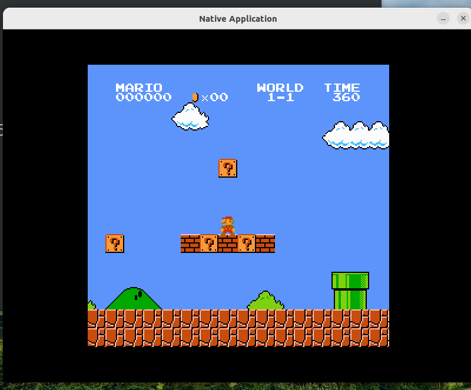

# PA1

**预计平均耗时**: 30小时

**阶段性安排**:

- task PA1.1: 实现单步执行, 打印寄存器状态, 扫描内存
- task PA1.2: 实现算术表达式求值
- task PA1.3: 实现所有要求, 提交完整的实验报告

正确的做法是:

- 多思考为什么
  - 从问题开始着手理解系统也是个不错的方法
- 独立解决问题
  - 即使是调一个很弱智的bug, "顺带"能学到的东西也比你想象中多得多
  - 换句话说, 如果你选择抱大腿, 你失去的机会也比你想象中多得多
- 尝试尽可能理解每一处细节
  - 将来调bug的时候, 这些细节就是你手中强有力的工具
  - 换句话说, 当你在调bug的时候感到无从下手, 一定是你不了解其中的细节
- 用正确的工具做事情
  - 这才是节省时间的科学方法, 而不是偷懒
- 多读讲义, 彩蛋很多
  - 讲义中特地设置了不少"不合时宜"的提示, 有的彩蛋要多次阅读才能明白其中的奥妙
  - 多看一道蓝框题, 也许能少调几天bug
- 按时完成, 拒绝拖延
  - 这样你才有时间做到上面几点

事实上, 这些做法就是PA中的最本质的能力训练, 而这样的训练, 在PA0就已经开始了: PA0之所以让大家白手装机, 就是希望让大家在解决小问题的过程中收获经验, 用来解决更大的问题; 同时也给大家传播"我可以通过STFW和RTFM独立解决问题"的最初原的信念, 这种信念可以帮助大家驱散对未知的恐惧.

你用来应付程序设计作业的心态, 在PA这里是混不过去的, 问题暴露的速度比你想象中快得多. 所以, 从今天开始, 不要偷懒了.

令人难绷的mario

