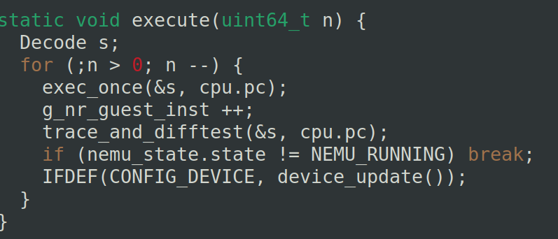
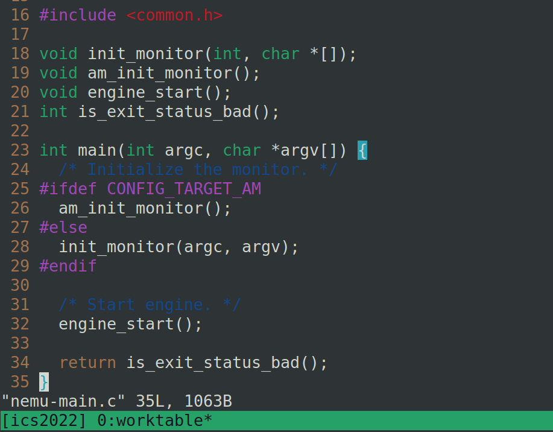
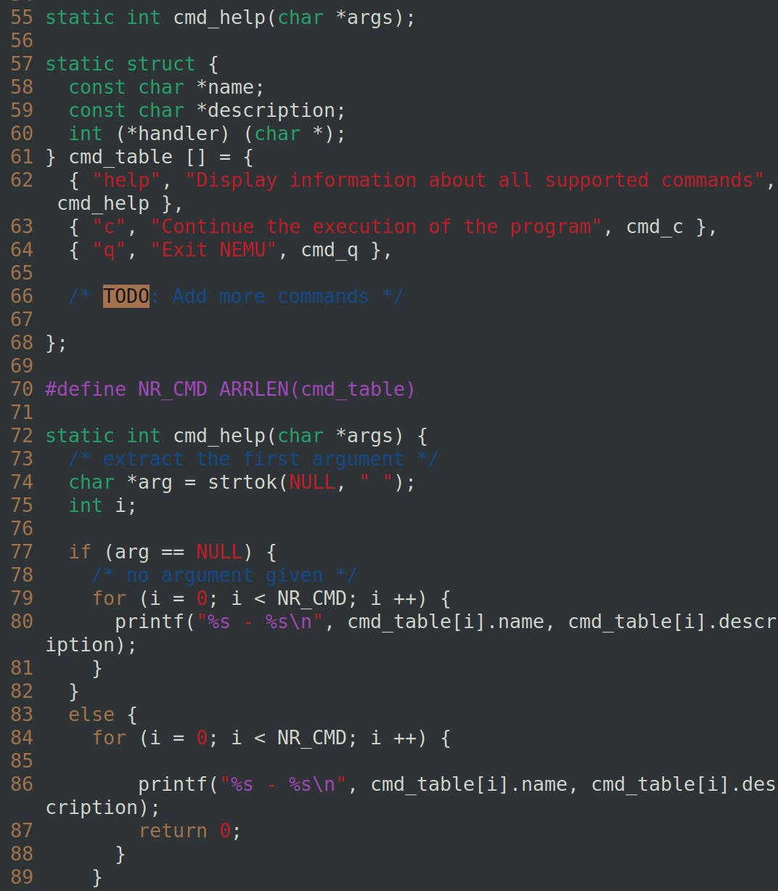

# PA1.3

## 尝试理解计算机如何计算

通过高速的基本计算如加法，计算机内部01结构特有的加法速度快

将大问题分解为 开始 ，循环，结束

## 从状态机视角理解程序运行

（0,x,x）->(1,0,x)->(2,0,0)->(3,0,1)->(4,1,1)->(2,1,1)->...

程序代码中的所有循环和函数调用都以指令的粒度被完全展开, 使得我们难以掌握程序的整体语义. 但对于程序的局部行为, 尤其是从静态视角来看难以理解的行为, 状态机视角可以让我们清楚地了解相应的细节

# PA1.4 RTFSC

在源代码中可以看到cpu_exec()


execute(n)在源码中是



这个-1 就是uint64_t 的最大值，相当于将程序执行完，每次一个exec_once ()

### 理解框架代码


### 优美的退出

先看下报错信息


第38行，返回的是$NEMU_EXEC，这里并不是make的问题而是在make中返回


找到nemu-main.c函数，肯定是is_exit_status_bad()抛出了什么东西




查看sdb.c



可以看到程序中的cmd_table，在cmd_help中

sdb_mainloop() -> rl_gets()
由于是make报错，所以原因肯定是返回值有问题（机器永远正确）

general-purpose registers : gpr(通用寄存器)

# 1.5基础设施


在基础设施中要实现sdb的调试功能

对于si [N],已经提供了cpu_exec函数，只要实现就行
`{ "si", "Execute for N step ,default 1", cmd_si }`注册之后

```c
static int cmd_si(char *args) {
  char *arg = strtok(NULL, " ");
  int n;
    
  if(arg == NULL){
    n = 1;
  } else {
    n = strtol(arg,NULL,10);
  }
  cpu_exec(n);
  return 0;
}
```

info  命令先实现reg的展示
```c
113 static int cmd_info(char *args) {
114   char *arg = strtok(NULL, " ");
115   if(arg == NULL){
116     printf("Usage:info r(registers) or info w(watchpoints)\n");
117 
118     return 0;
119   }else{
120     if(strcmp(arg, "r") == 0){
121       isa_reg_display();
122     }else if(strcmp(arg, "w") == 0){
123       printf("To do after watchpoint is made\n"); //to_do
124     }else{
125       printf("Usage:info r(registers) or info w(watchpoints)\n");
126     }
127 
128     return 0;
129   }
130 }

 26 void isa_reg_display() {
 27   int reg_num = ARRLEN(regs);
 28   int i;
 29 
 30   for(i=0;i<reg_num;i++){
 31     printf("%-8s-%-#20lx-%-20ld\n",regs[i],(long unsigned int)cpu.gpr[i],(long int)cpu.gpr[i]);
 32   }
 33   
 34 }

```


# 1.5 表达式求值

在这里使用如下方法来解决表达式求值的问题:

1. 首先识别出表达式中的单元
2. 根据表达式的归纳定义进行递归求值

词法分析需要完成以下的内容:

- 识别出表达式中的所有单元，如`+,-,*,/,1`等，特别是要能识别出复杂的表达式如0xc0100000+ (ra +5)*4 - ( a4 + 8)内部的token
- 为算术表达式中的各种token类型添加规则, 我们需要注意C语言字符串中转义字符的存在和**[正则表达式](https://www.zhihu.com/search?q=正则表达式&search_source=Entity&hybrid_search_source=Entity&hybrid_search_extra={"sourceType"%3A"article"%2C"sourceId"%3A413911195})**中元字符的功能.这些规则会在monitor初始化的时候通过`init_regex()`被编译成一些用于进行pattern匹配的内部信息
- 在成功识别出token后, 将token的信息依次记录到`tokens`数组中

识别token主要靠make_token()函数， 它用`position`变量来指示当前处理到的位置, 并且按顺序尝试用不同的规则来匹配当前位置的字符串. 当一条规则匹配成功, 并且匹配出的子串正好是`position`所在位置的时候, 就成功地识别出一个token


你需要完成以下的内容:

- 为算术表达式中的各种token类型添加规则, 你需要注意C语言字符串中转义字符的存在和正则表达式中元字符的功能.
- 在成功识别出token后, 将token的信息依次记录到`tokens`数组中.
