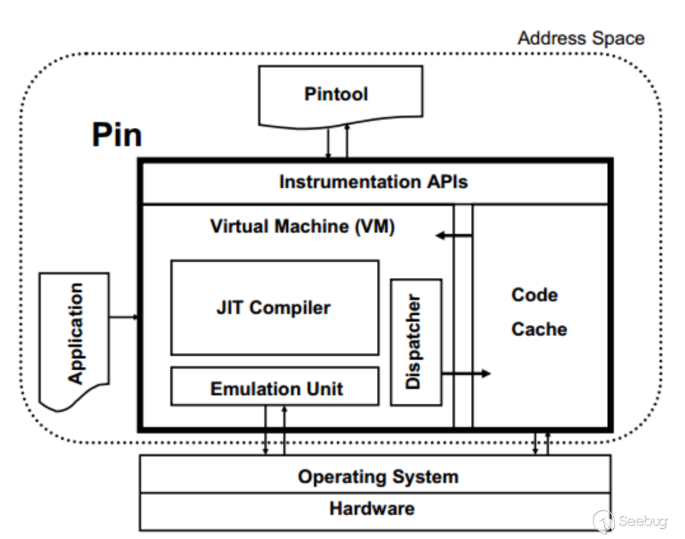

## Pin

The best way to think about Pin is as a "just in time" (JIT) compiler. The input to this compiler is not bytecode, however, but a regular executable. Pin intercepts the execution of the first instruction of the executable and generates ("compiles") new code for the straight line code sequence starting at this instruction. It then transfers control to the generated sequence. The generated code sequence is almost identical to the original one, but Pin ensures that it regains control when a branch exits the sequence. After regaining control, Pin generates more code for the branch target and continues execution. Pin makes this efficient by keeping all of the generated code in memory so it can be reused and directly branching from one sequence to another.

