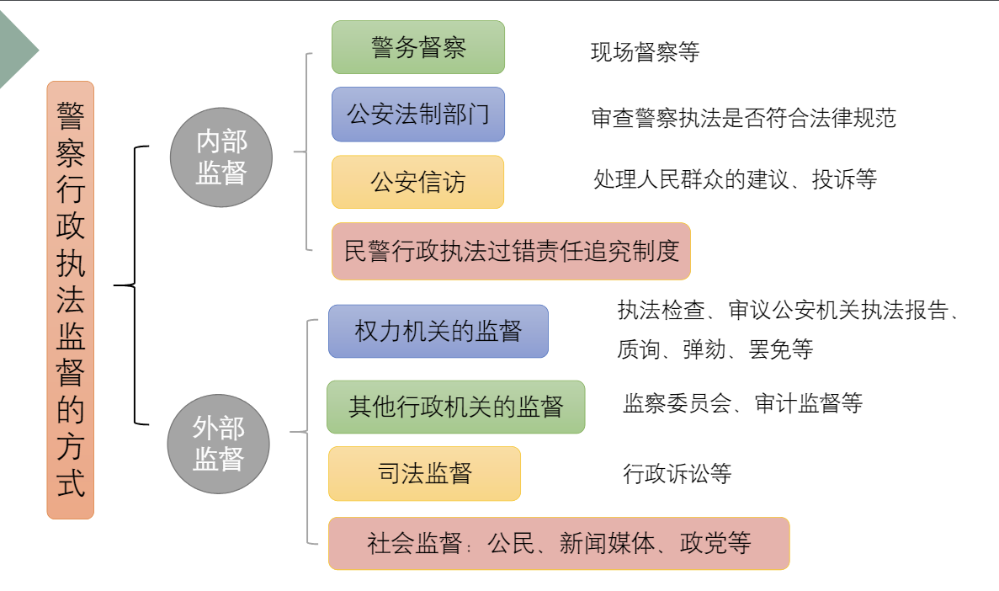

# 警察行政执法监督

## 概述

警察行政执法监督，是指**国家权力机关、司法机关、警察系统内部的专门机关以及公民、组织**依法对**警察行政主体及其警务人员行使警察行政职权行为**的监督。

监督主体多元化，对象特定性，方式多样性，内容全面性，过程程序性

公开原则公平、公正原则、效率原则

警察内部监督，是指警察主体自身对警察行使权力、履行职责、遵守纪律的情况进行的监督。

监督范围的广泛性、监督过程的主动性、监督的效率性

内部：**警务督察制度、法制部门监督、公安信访制度、民警行政执法过错责任追究制度**

外部监督：**警察行政执法外部监督，是指由国家权力机关、国家监察机关、国家司法机关、公民和社会组织对公安机关和人民警察实施的行政执法行为的监督。**

外部：**国家权力机关的监督，监察委员会的监督、行政诉讼监督（司法监督）、社会监督**