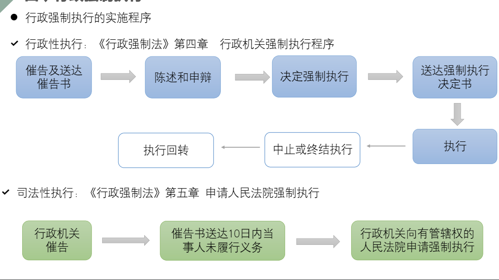

# 警察行政行为

## 行政命令

概念：行政主体赋予一定范围内单个或多个相对人的作为或不作为义务的具体行政行为。

口头命令：盘问，即时性

书面命令：

标志：

自动化的行政命令：

依职权的、负担性、要式、裁量性、和平性

## 行政处罚

概念：指**行政主体**依法对**违反行政管理秩序**的公民、法人或其他组织，以减损权益或增加义务的方式予以惩戒的行为。

依职权的、负担性的、要式的、裁量性的、具体的

● 处罚法定原则

● 公正公开原则

● 处罚与教育相结合原则

● 保障当事人权利原则

● 职能分离原则：罚缴分离

● 一事不再罚原则

申诫罚：警告、通报批评

财产罚：罚款、没收违法所得、没收非法财物

行为罚：责令停产停业、责令关闭、限制从业、暂扣许可证或执照、吊销许可证或执照。

人身罚：行政拘留、驱逐出境禁止入境或出境、限期离境

设定：法律（所有）、行政法规（不能限制人身自由）、地方性法规（除限制人身自由、吊销企业营业执照）

实施：行政主体根据法律规定，对出现违反相关法律规范的情形，经过调查确定违法行为及行为人后，从已经依法设定的行政处罚中选择某种处罚形式而给予违法者处罚的行政活动。

1、拥有行政处罚权的机关2、法律法规授权的组织3、行政处罚的实施机关可委托一定范围的其他主体实施处罚

管辖：一般违法行为发生地处罚，黄赌毒必须发生地处罚

行政处罚的实施整体流程：调查、决定、执行

简易程序：**违法事实确凿并有法定依据**，对公民处以二百元以下、对法人或者其他组织处以三千元以下罚款或者警告的行政处罚的，可以当场作出行政处罚决定。法律另有规定的，从其规定。1、表明执法身份2、收集证据3、口头告知违法行为人拟做出行政处罚决定的事实理由和依据，并告知陈述权和申辩权4、充分听取行为人的陈述和申辩

快速办理程序：不适用简易程序但事实清楚，违法嫌疑人自愿认罪认罚，且对违法事实和法律适用没有异议的行政案件。

+ 不适用情形：盲聋哑人未成年、精神病，依法适用听证程序的，十日以上拘留的

普通程序：

+ 调查：1、出示证件，执法人员不少于两人2、取证3、制作笔录
+ 听证程序：依申请，下列情况：较大数额罚款、没收较大、降低资质等级、吊销许可证件，责令停产停业、责令关闭限制从业。五日内提出

简易程序：书面处罚+当场交付，24小时内备案可以由一名作出处罚决定

快速办理：到案后48小时做出处理决定

普通程序：立案90日内作出行政处罚决定。办理治安案件的期限，自受理之日起不得超过30日**送达**7日内送达

案例：2006年 8 月 17 日，李某来到当地公安机关办理第二代居民身份证，并将已过期的第一代居民身份证交付审验。公安机关以第一代居民身份证已过期为由，除收取 20 元工本费外，还责令李某缴纳了 50元罚款。收取罚款时公安机关并未出具行政处罚决定书。当李某问起为何要罚款时，工作人员回答这是市公安局的统一规定。10 月 20 日，李某领取第二代居民身份证后，愈觉50元罚款出得冤枉，遂于 10 月25 日向当地法院提起了行政诉讼，要求公安机关撤销口头行政处罚，退还罚款。法院以违反法定程序、滥用职权为由，支持了李某的全部诉讼请求。

市一级公安机关无权设定行政处罚，也无权自定罚款项目，该案中，行政处罚的设定无效。未告知当事人作出行政处罚决定的事实、理由及依据，以及当事人依法享有的权利，违反了法定程序。既未向其交付书面行政处罚决定书，也不属于法律规定的可以当场收缴的情形，违反了法定程序。

## 行政许可

概念：在**法律规范一般禁止**的情况下，**行政主体**根据行政相对人的**申请**，经**依法审查**，通过**颁发许可证或者执照**等形式，依法作出准予或者不准予特定的行政相对人从事**特定活动**的行政行为。

法定性、解禁性、赋权性（与法定性、制裁性、处分性

依申请、授益性、要式、羁束性、和平性

● 普通、一般许可：直接涉及国家安全、公共安全、经济宏观调控、生态环境保护、直接关系人身健康或生命财产安全等特定活动，需要按照法定条件予以批准的事项

● 特别许可：有限自然资源开发利用、公共资源配置、直接关系公共利益的特定行业市场准入等

● 认可：提供公众服务，需要确定具备特定资质、资格的事项

● 核准：直接关系公共安全等的重要设备、设施、产品、物品

● 登记：需要确定主体资格的事项

● 法律法规规定的其他事项

设定

实施：

## 行政强制

概念：在行政过程中出现违反义务或者义务不履行的情况下，为了确保行政的实效性，维护和实现公共利益，由**行政主体或者行政主体申请人民法院**，对公民、法人或者其他组织的财产以及人身、自由等权益予以强制而采取的措施。

性质：依职权、负担性、要式、裁量性、具体

特征：法定性、从属性（伴随其他行政行为）、物理性

种类：

（一）行政强制措施，暂时性限制

对人身：限制公民人身自由：强制传唤、带至公安机关继续盘问、约束（至酒醒）等

对财产：查封场所，设施或者财物：就地封存

扣押财物：转移占有；冻结存款，汇款

其他强制措施：盘问、封锁现场、强制检查

（二）行政强制执行

行政机关或者行政机关申请人民法院，对不履行行政决定的公民、法人或者其他组织，依法强制履行义务的行为

直接强制：

1、代履行：收钱办事

2、执行罚：不可替代的 滞纳金。有催促义务

执行程序：

行政强制执行，司法性执行

● 警察柔性行政方式

● 略