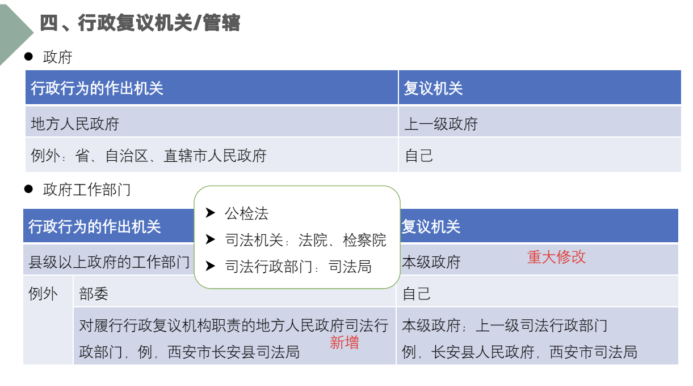
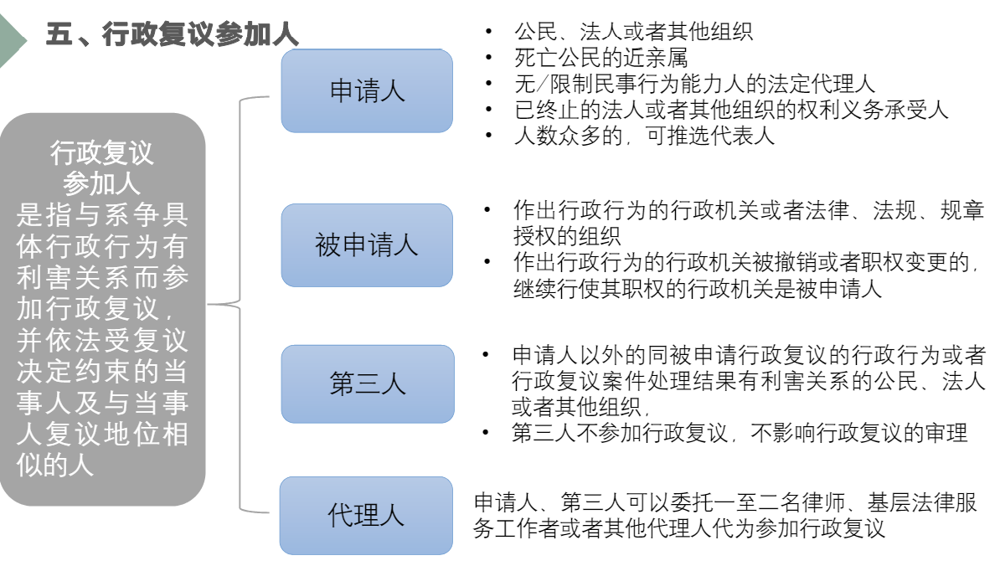
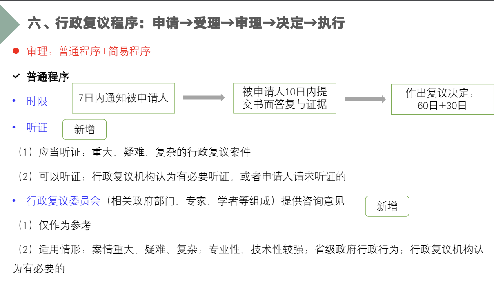
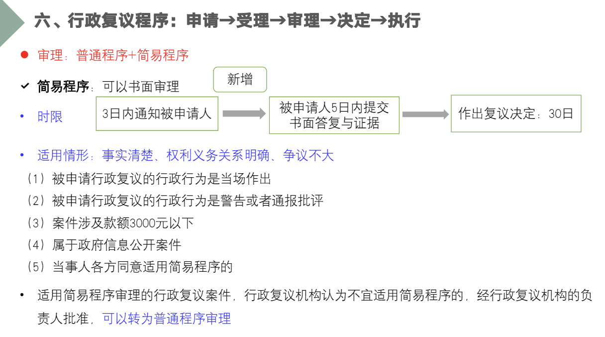

# 警察行政救济

## 警察行政复议

指**公民、法人或其他组织**对**警察机关或行使警察职权的法律、法规授权组织**所作的**行政行为**不服，依法提出申请的行政复议。

1、是化解行政争议的主渠道2、是特定行政机关的活动3、既审查合法性，又审查合理性4、是依申请的行政行为

**范围：**

不可行政复议：国家行为，规范性文件，内部奖惩任免，调解。刑事司法行为，调解，鉴定结论，申诉被驳回

集中管辖原则：部门即本级人民政府

政府行为则找上一级政府

垂直领导机关：上一级

行政复议程序：申请（60日，书面或者口头，可委托），受理（5日内审查，不符合条件的不予受理），审查（原则上书面审查，申请人提出要求或复议机关认为有必要时可听取意见，审查不停止执行），决定，执行。

## 警察行政诉讼

警察行政诉讼，是指**公民、法人或其他组织对警察机关或行使警察职权**的法律、法规授权组织所作的**具体行政行为**不服，依法提起的行政诉讼

由被告证明行政行为合法

受案范围：不可以的：抽象行政行为

## 警察行政赔偿

公民、 法人或其他组织在警察机关或行使警察职权的法律、法 规授权组织行使职权的过程中遭受一定类型的侵害，依法提出诉求，请求国家给予物质赔偿的一种救济途径。