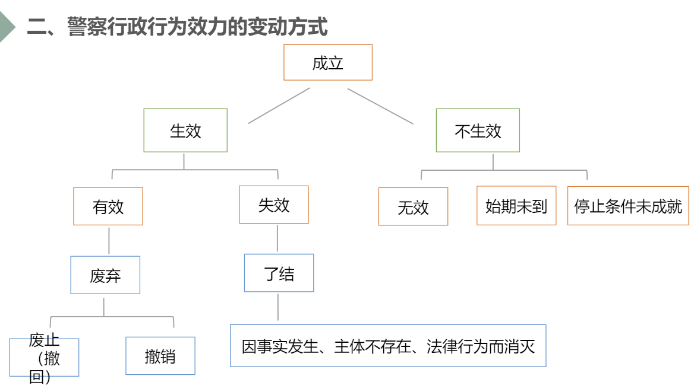

# 警察行政行为

## 警察行政行为的概念

概念：是指**警察行政主体**在**行使相关行政职权、履行相关行政职责**时作出的具有**行政法意义**的行为

## 警察行政行为的类型及形式

+ 依职权的警察行政行为与依申请的警察行政行为

+ 羁束性警察行政行为与裁量性警察行政行为
+ 要式警察行政行为与非要式警察行政行为
+ 抽象警察行政行为与具体警察行政行为
+ 授益性警察行政行为与负担性警察行政行为

+ 和平性警察行政行为与武力性警察行政行为

## 警察行政行为合法要件

成立要件：主体要件、主观方面要件、客观方面要件

**合法要件：权限要件、程序要件、实体要件**

## 警察行政行为效力

公定力：公定力，又称先定力，是指行政行为一旦做出，除自始无效以外，就具有推定有效而要求所有机关、组织予以承认、尊重和服从的一种法律效力

确定力：指已经生效的行政行为对行政主体和行政相对人所具有的不受任意改变的法律效力

（1）要求行政主体不得在无法律依据的前提下任意改变已经做出的行政行为（2）也要求行政主体在有法律依据的前提下改变已经做出的行为行为时，须对因此受不利影响的 组织和个人作出赔偿或补偿

拘束力：警察行政行为成立后，其内容对行政主体和行政相对人所产生的法律上的约束效力，行政主体和行政相对人必须遵守服从

（1）行政行为所产生、变更、消灭或确认的法律关系得到法律的认可（2）行政行为所产生、变更、消灭或确认的法律关系在其他诉讼中也得到一定程度的承认，部分情况下法院中止或终结民事案件的审理，等待行政争议解决或者与行政争议合并审理，或直接以行政行为为依据作出判决而不对行政行为的合法性作出审查

执行力：要求行政主体和行政相对人对已经生效的行政行为的内容予以实现的法律效力。

变动方式：无效、撤销、变更、废止、失效

