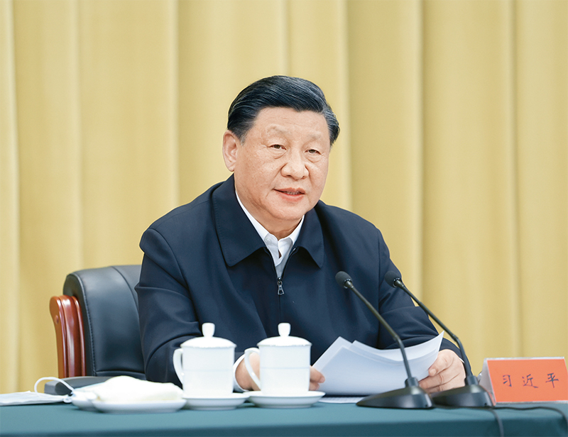
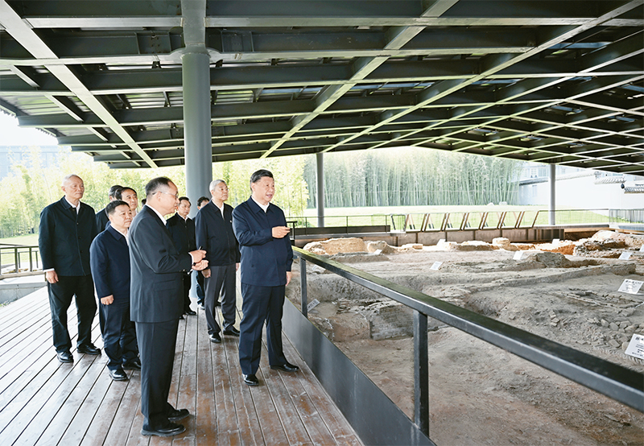
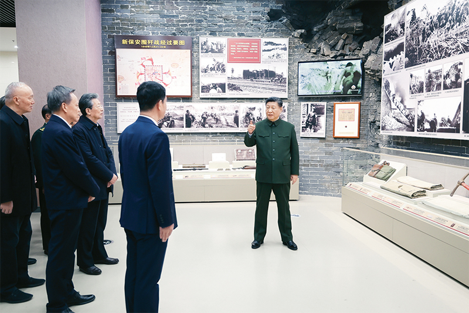
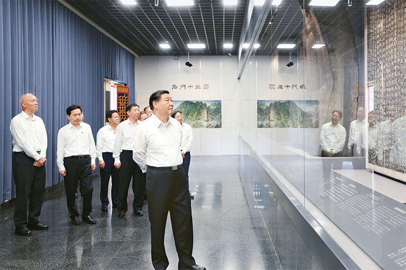

**加强文化遗产保护传承 弘扬中华优秀传统文化※**

习近平

**一**

　　宣传阐释中国特色，要讲清楚每个国家和民族的历史传统、文化积淀、基本国情不同，其发展道路必然有着自己的特色；讲清楚中华文化积淀着中华民族最深沉的精神追求，是中华民族生生不息、发展壮大的丰厚滋养；讲清楚中华优秀传统文化是中华民族的突出优势，是我们最深厚的文化软实力；讲清楚中国特色社会主义植根于中华文化沃土、反映中国人民意愿、适应中国和时代发展进步要求，有着深厚历史渊源和广泛现实基础。中华民族创造了源远流长的中华文化，中华民族也一定能够创造出中华文化新的辉煌。独特的文化传统，独特的历史命运，独特的基本国情，注定了我们必然要走适合自己特点的发展道路。对我国传统文化，对国外的东西，要坚持古为今用、洋为中用，去粗取精、去伪存真，经过科学的扬弃后使之为我所用。

（2013年8月19日在全国宣传思想工作会议上的讲话）

**二**

　　我们的城市有许多历史记忆，特别是一些历史悠久的老城区，是最宝贵的东西，不能因为浮躁、无知而破坏掉。有的城市把真古董拆了建假古迹，我看到一份材料，说全国有三十多个城市已经或正在谋划搞古城重建，搞什么潘金莲故居、阿房宫重建！还有一些地方热衷于改老地名，喜欢起一些洋气一点的地名，如“曼哈顿”、“威尼斯”、“加州1886”、“玛斯兰德”等，五花八门，与中国历史文化协调吗？不仅群众看得一头雾水、莫名其妙，而且也割断了地名文脉、不利于传承我们的民族文化。更何况有些情况也是违法的，我国地名管理条例实施细则明确规定不以外国人名、地名命名我国地名。传承文化不是要简单复古，城市建设会不断融入现代元素，但必须同步保护和弘扬传统优秀文化，延续城市历史文脉。

（2013年12月12日在中央城镇化工作会议上的讲话）

****

　　2023年6月2日，中共中央总书记、国家主席、中央军委主席习近平在北京出席文化传承发展座谈会并发表重要讲话。 新华社记者 鞠鹏/摄

**三**

　　中华文化是我们提高国家文化软实力最深厚的源泉，是我们提高国家文化软实力的重要途径。要使中华民族最基本的文化基因与当代文化相适应、与现代社会相协调，以人们喜闻乐见、具有广泛参与性的方式推广开来，把跨越时空、超越国度、富有永恒魅力、具有当代价值的文化精神弘扬起来，把继承传统优秀文化又弘扬时代精神、立足本国又面向世界的当代中国文化创新成果传播出去。要系统梳理传统文化资源，让收藏在禁宫里的文物、陈列在广阔大地上的遗产、书写在古籍里的文字都活起来。

（2013年12月30日在十八届中央政治局第十二次集体学习时的讲话）

**四**

　　每一种文明都延续着一个国家和民族的精神血脉，既需要薪火相传、代代守护，更需要与时俱进、勇于创新。中国人民在实现中国梦的进程中，将按照时代的新进步，推动中华文明创造性转化和创新性发展，激活其生命力，把跨越时空、超越国度、富有永恒魅力、具有当代价值的文化精神弘扬起来，让收藏在博物馆里的文物、陈列在广阔大地上的遗产、书写在古籍里的文字都活起来，让中华文明同世界各国人民创造的丰富多彩的文明一道，为人类提供正确的精神指引和强大的精神动力。

（2014年3月27日在法国巴黎联合国教科文组织总部的演讲）

**五**

　　我讲过，城市建设，要让居民望得见山、看得见水、记得住乡愁。“记得住乡愁”，就要保护弘扬中华优秀传统文化，延续城市历史文脉，保留中华文化基因。要保护好前人留下的文化遗产，包括文物古迹，历史文化名城、名镇、名村，历史街区、历史建筑、工业遗产，以及非物质文化遗产，不能搞“拆真古迹、建假古董”那样的蠢事。既要保护古代建筑，也要保护近代建筑；既要保护单体建筑，也要保护街巷街区、城镇格局；既要保护精品建筑，也要保护具有浓厚乡土气息的民居及地方特色的民俗。

（2015年12月20日在中央城市工作会议上的讲话）

**六**

　　文物承载灿烂文明，传承历史文化，维系民族精神，是老祖宗留给我们的宝贵遗产，是加强社会主义精神文明建设的深厚滋养。保护文物功在当代、利在千秋。

（2016年3月23日关于做好文物工作的批示）

　　2023年10月10日至13日，中共中央总书记、国家主席、中央军委主席习近平在江西考察。这是11日上午，习近平在景德镇市陶阳里历史文化街区南麓遗址考察。 新华社记者 谢环驰/摄

**七**

　　中华民族历史悠久，中华文明源远流长，中华文化博大精深，一个博物馆就是一所大学校。博物馆建设要注重特色。向海之路是一个国家发展的重要途径，这里围绕古代海上丝绸之路陈列的文物都是历史、是文化。要让文物说话，让历史说话，让文化说话。要加强文物保护和利用，加强历史研究和传承，使中华优秀传统文化不断发扬光大。要增强文化自信，在传承中华优秀传统文化基础上发展社会主义先进文化，加快建设社会主义文化强国。

（2017年4月19日在广西考察时的讲话）

**八**

　　我们要深入挖掘、继承、创新优秀传统乡土文化。要让有形的乡村文化留得住，充分挖掘具有农耕特质、民族特色、地域特点的物质文化遗产，加大对古镇、古村落、古建筑、民族村寨、文物古迹、农业遗迹的保护力度。要让活态的乡土文化传下去，深入挖掘民间艺术、戏曲曲艺、手工技艺、民族服饰、民俗活动等非物质文化遗产。要把保护传承和开发利用有机结合起来，把我国农耕文明优秀遗产和现代文明要素结合起来，赋予新的时代内涵，让中华优秀传统文化生生不息，让我国历史悠久的农耕文明在新时代展现其魅力和风采。

（2017年12月28日在中央农村工作会议上的讲话）

**九**

　　我国是统一的多民族国家，中华民族是多民族不断交流交往交融而形成的。中华文明植根于和而不同的多民族文化沃土，历史悠久，是世界上唯一没有中断、发展至今的文明。要重视少数民族文化保护和传承，支持和扶持《格萨（斯）尔》等非物质文化遗产，培养好传承人，一代一代接下来、传下去。要引导人们树立正确的历史观、国家观、民族观、文化观，不断巩固各族人民对伟大祖国的认同、对中华民族的认同、对中国特色社会主义道路的认同。

（2019年7月15日在内蒙古考察时的讲话）

**十**

　　研究和弘扬敦煌文化，既要深入挖掘敦煌文化和历史遗存背后蕴含的哲学思想、人文精神、价值理念、道德规范等，推动中华优秀传统文化创造性转化、创新性发展，更要揭示蕴含其中的中华民族的文化精神、文化胸怀和文化自信，为新时代坚持和发展中国特色社会主义提供精神支撑。要加强对国粹传承和非物质文化遗产保护的支持和扶持，加强对少数民族历史文化的研究，铸牢中华民族共同体意识。

（2019年8月19日在敦煌研究院座谈时的讲话）

**十一**

　　考古遗迹和历史文物是历史的见证，必须保护好、利用好。要建立健全历史文化遗产资源资产管理制度，建设国家文物资源大数据库，加强相关领域文物资源普查、名录公布的统筹指导，强化技术支撑，引导社会参与。要把历史文化遗产保护放在第一位，同时要合理利用，使其在提供公共文化服务、满足人民精神文化生活需求方面充分发挥作用。要健全不可移动文物保护机制，把文物保护管理纳入国土空间规划编制和实施。要制定“先考古、后出让”的制度设计和配套政策，对可能存在历史文化遗存的土地，在依法完成考古调查、勘探、发掘前不得使用。要深刻汲取国内外重大文物灾害事故教训，督察落实主体责任，强化隐患整治，增强历史文化遗产防护能力。要加强执法督察，规范举报流程，严厉打击文物犯罪。

（2020年9月28日在十九届中央政治局第二十三次集体学习时的讲话）

**十二**

　　革命文物承载党和人民英勇奋斗的光荣历史，记载中国革命的伟大历程和感人事迹，是党和国家的宝贵财富，是弘扬革命传统和革命文化、加强社会主义精神文明建设、激发爱国热情、振奋民族精神的生动教材。

　　加强革命文物保护利用，弘扬革命文化，传承红色基因，是全党全社会的共同责任。各级党委和政府要把革命文物保护利用工作列入重要议事日程，加大工作力度，切实把革命文物保护好、管理好、运用好，发挥好革命文物在党史学习教育、革命传统教育、爱国主义教育等方面的重要作用，激发广大干部群众的精神力量，信心百倍为全面建设社会主义现代化国家、实现中华民族伟大复兴中国梦而奋斗。

（2021年3月对革命文物工作的指示）

****

　　2024年2月1日至2日，中共中央总书记、国家主席、中央军委主席习近平来到天津，看望慰问基层干部群众。这是2日上午，习近平在平津战役纪念馆考察。 新华社记者 鞠鹏/摄

**十三**

　　红色资源是我们党艰辛而辉煌奋斗历程的见证，是最宝贵的精神财富，一定要用心用情用力保护好、管理好、运用好。一是要加强科学保护。红色资源是不可再生、不可替代的珍贵资源，保护是首要任务。要本着对历史负责、对人民负责的态度，深入开展红色资源专项调查，加强红色遗址、革命文物保护工作，统筹好抢救性保护和预防性保护、本体保护和周边保护、单点保护和集群保护等。二是要开展系统研究。统筹研究力量，强化研究规划，积极开展革命史料的抢救、征集和研究工作，加强革命历史研究，深入挖掘红色资源背后的思想内涵，准确把握党的历史发展的主题主线、主流本质，旗帜鲜明反对和抵制历史虚无主义。三是要打造精品展陈。坚持政治性、思想性、艺术性相统一，把好导向、聚焦主题，用史实说话，着力打造高质量精品展陈，增强表现力、传播力、影响力，生动传播红色文化。四是要强化教育功能。围绕革命、建设、改革各个历史时期的重大事件、重大节点，研究确定一批重要标识地，讲好党的故事、革命的故事、英雄的故事，彰显时代特色，使之成为教育人、激励人、塑造人的大学校。要设计符合青少年认知特点的教育活动，建设富有特色的革命传统教育、爱国主义教育、青少年思想道德教育基地，引导他们从小在心里树立红色理想。

（2021年6月25日在十九届中央政治局第三十一次集体学习时的讲话）

**十四**

　　要加强文物保护利用和文化遗产保护传承，提高文物研究阐释和展示传播水平，让文物真正活起来，成为加强社会主义精神文明建设的深厚滋养，成为扩大中华文化国际影响力的重要名片。

（2021年11月24日在中央全面深化改革委员会第二十二次会议上的讲话）

**十五**

　　历史文化遗产承载着中华民族的基因和血脉，不仅属于我们这一代人，也属于子孙万代。要敬畏历史、敬畏文化、敬畏生态，全面保护好历史文化遗产，统筹好旅游发展、特色经营、古城保护，筑牢文物安全底线，守护好前人留给我们的宝贵财富。

（2022年1月27日在山西晋中考察时的讲话）

**十六**

　　让更多文物和文化遗产活起来，营造传承中华文明的浓厚社会氛围。文物和文化遗产承载着中华民族的基因和血脉，是不可再生、不可替代的中华优秀文明资源。我们要积极推进文物保护利用和文化遗产保护传承，挖掘文物和文化遗产的多重价值，传播更多承载中华文化、中国精神的价值符号和文化产品。

　　中国共产党人不是历史虚无主义者、文化虚无主义者，不能数典忘祖、妄自菲薄。各级领导干部都要敬畏历史、敬畏优秀传统文化，重视文物保护利用和文化遗产保护传承工作，为历史和考古工作者开展研究、学习深造、研修交流提供更多政策支持。要营造传承中华文明的浓厚社会氛围，广泛宣传中华文明探源工程等研究成果，教育引导群众特别是青少年更好认识和认同中华文明，增强做中国人的志气、骨气、底气。

（2022年5月27日在十九届中央政治局第三十九次集体学习时的讲话）

**十七**

　　中华文明博大精深、源远流长，是由各民族优秀文化百川汇流而成。要加强中华民族共同体历史、中华民族多元一体格局的研究，充分挖掘和有效运用新疆各民族交往的历史事实、考古实物、文化遗存，讲清楚新疆自古以来就是我国不可分割的一部分和多民族聚居地区，新疆各民族是中华民族大家庭血脉相连、命运与共的重要成员。要加强非物质文化遗产保护传承，把各民族优秀传统文化发扬光大。

（2022年7月13日在新疆考察时的讲话）

****

　　2023年7月29日，中共中央总书记、国家主席、中央军委主席习近平在四川考察结束返京途中，来到陕西省汉中市考察。这是习近平参观汉中市博物馆有关历史文物展陈。 新华社记者 鞠鹏/摄

**十八**

　　殷墟出土的甲骨文为我们保存3000年前的文字，把中国信史向上推进了约1000年。殷墟我向往已久，这次来是想更深地学习理解中华文明，古为今用，为更好建设中华民族现代文明提供借鉴。中国的汉文字非常了不起，中华民族的形成和发展离不开汉文字的维系。在这方面，考古事业居功至伟。考古工作要继续重视和加强，继续深化中华文明探源工程。中华文明源远流长，从未中断，塑造了我们伟大的民族，这个民族还会伟大下去的。要通过文物发掘、研究保护工作，更好地传承优秀传统文化。

（2022年10月28日在河南安阳考察时的讲话）

**十九**

　　亚洲是人类文明重要发祥地，孕育并保有着极其丰富的文化遗产，为世界文明发展史书写了浓墨重彩的篇章。2019年，我在亚洲文明对话大会上倡议开展亚洲文化遗产保护行动。4年来，各方积极响应、共同努力，在古代文明研究、联合考古、古迹修复、博物馆交流等方面开展务实合作，为保护人类文明精华作出亚洲新贡献。

　　亚洲文化遗产保护联盟的成立，有利于加强亚洲文化遗产保护，深化亚洲文明交流，繁荣世界文明百花园，为人类文明进步贡献力量。中国愿在联盟框架下，同亚洲各国携手加强文化遗产保护经验交流，积极推动文化遗产领域国际合作，构建全球文明对话合作网络，促进各国人民相知相亲，共同推动人类文明发展进步。

（2023年4月25日致亚洲文化遗产保护联盟大会的贺信）

**二十**

　　博物馆有很多宝贵文物甚至“国宝”，它们实证了我国百万年的人类史、一万年的文化史、五千多年的文明史，要深入实施中华文明探源工程，把中国文明历史研究引向深入。要认真贯彻落实党中央关于坚持保护第一、加强管理、挖掘价值、有效利用、让文物活起来的工作要求，全面提升文物保护利用和文化遗产保护传承水平。

（2023年5月16日在山西运城考察时的讲话）

**二十一**

　　中华民族具有悠久的优秀传统文化，自古就有开放包容、兼收并蓄的文化胸怀，中华文明历来赞赏不同文明间的相互理解和尊重。北京历史悠久，文脉绵长，是中华文明连续性、创新性、统一性、包容性、和平性的有力见证。中国将更好发挥北京作为历史古都和全国文化中心的优势，加强同全球各地的文化交流，共同推动文化繁荣发展、文化遗产保护、文明交流互鉴，践行全球文明倡议，为推动构建人类命运共同体注入深厚持久的文化力量。

（2023年9月14日致2023北京文化论坛的贺信）

**二十二**

　　世界由丰富多彩的文明构成，中国是有着世界上最古老历史和文化的国家之一。中国愿同联合国教科文组织开展更紧密合作，不断提高遗产保护能力和水平，促进各种文明交流互鉴、包容合作，助力世界和平，推动构建人类命运共同体。

（2023年9月28日在会见联合国教科文组织总干事阿祖莱时的讲话）

　　※这是习近平总书记2013年8月至2023年9月期间有关加强文化遗产保护传承，弘扬中华优秀传统文化重要论述的节录。