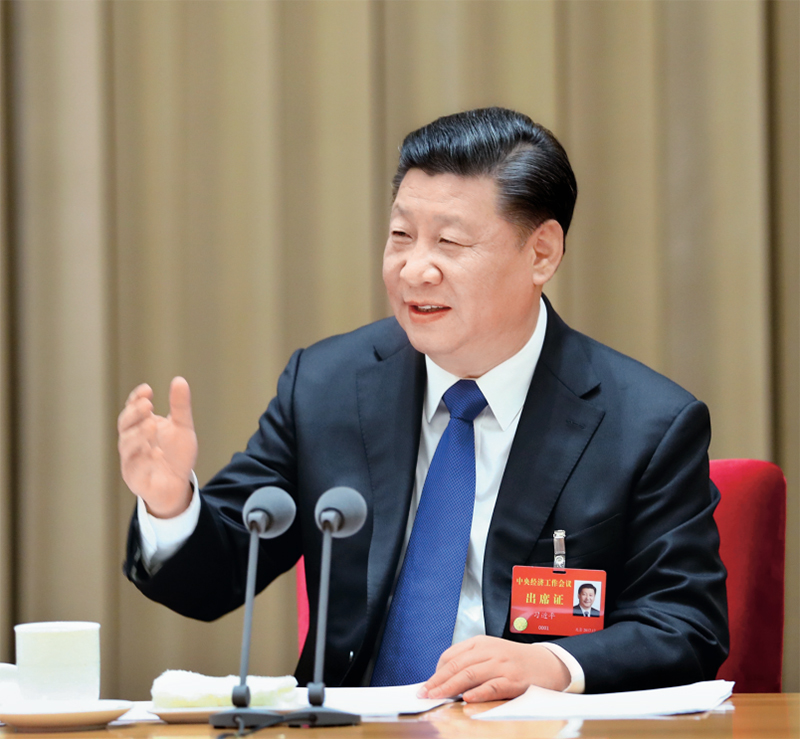
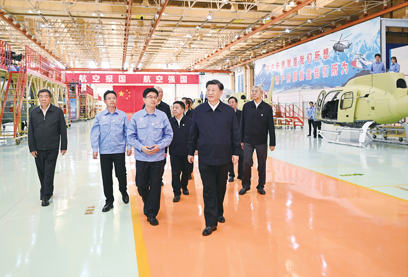
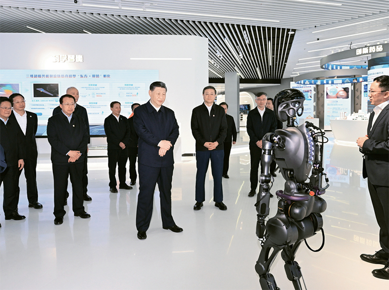
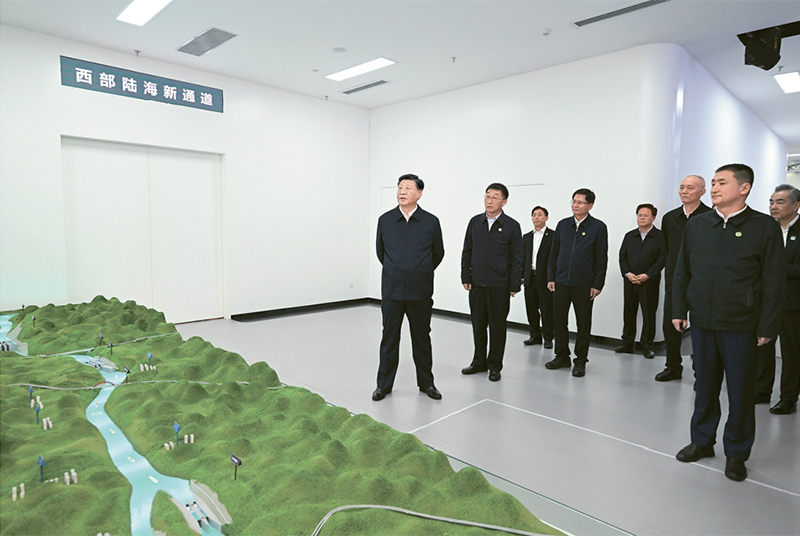
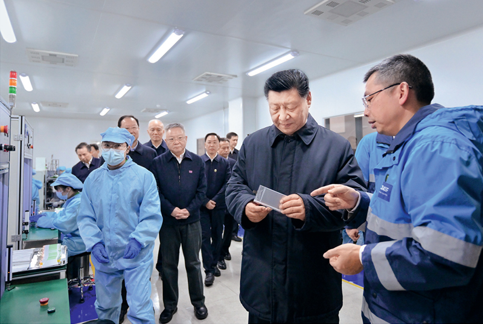
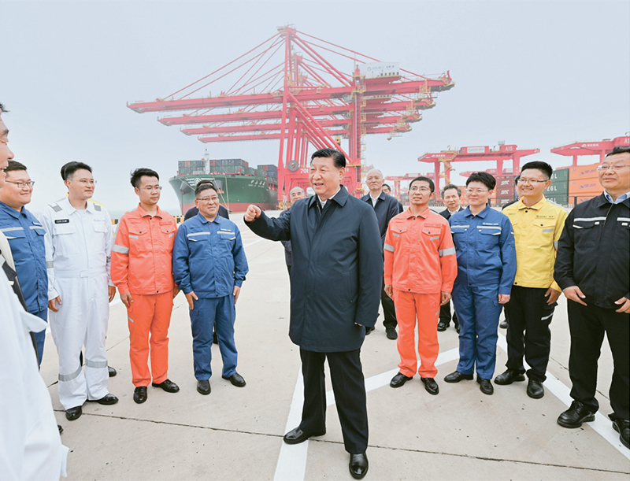

**开创我国高质量发展新局面※**

习近平

**一**

　　我国经济已由高速增长阶段转向高质量发展阶段，正处在转变发展方式、优化经济结构、转换增长动力的攻关期，建设现代化经济体系是跨越关口的迫切要求和我国发展的战略目标。必须坚持质量第一、效益优先，以供给侧结构性改革为主线，推动经济发展质量变革、效率变革、动力变革，提高全要素生产率，着力加快建设实体经济、科技创新、现代金融、人力资源协同发展的产业体系，着力构建市场机制有效、微观主体有活力、宏观调控有度的经济体制，不断增强我国经济创新力和竞争力。

（2017年10月18日在中国共产党第十九次全国代表大会上的报告）

　　2017年12月18日至20日，中央经济工作会议在北京举行。中共中央总书记、国家主席、中央军委主席习近平发表重要讲话。 新华社记者 谢环驰/摄

**二**

　　中国特色社会主义进入了新时代，我国经济发展也进入了新时代。新时代我国经济发展的特征，就是我在党的十九大报告中强调的，我国经济已由高速增长阶段转向高质量发展阶段。这是一个重大判断，我们必须深刻认识其重大现实意义和深远历史意义。

　　第一，这是保持经济持续健康发展的必然要求。我国正处于转变发展方式的关键阶段，劳动力成本上升、资源环境约束增大、粗放的发展方式难以为继，经济循环不畅问题十分突出。同时，世界新一轮科技革命和产业变革方兴未艾、多点突破。我们必须推动高质量发展，以适应科技新变化、人民新需要，形成优质高效多样化的供给体系，提供更多优质产品和服务。这样，供求才能在新的水平上实现均衡，我国经济才能持续健康发展。

　　第二，这是适应我国社会主要矛盾变化和全面建成小康社会、全面建设社会主义现代化国家的必然要求。我国社会主要矛盾发生了重大变化，我国经济发展阶段也在发生历史性变化，不平衡不充分的发展就是发展质量不高的表现。解决我国社会的主要矛盾，必须推动高质量发展。我们要重视量的发展，但更要重视解决质的问题，在质的大幅提升中实现量的有效增长。

　　第三，这是遵循经济规律发展的必然要求。上世纪60年代以来，全球100多个中等收入经济体中只有十几个成功进入高收入经济体。那些取得成功的国家，就是在经历高速增长阶段后实现了经济发展从量的扩张转向质的提高。那些徘徊不前甚至倒退的国家，就是没有实现这种根本性转变。经济发展是一个螺旋式上升的过程，上升不是线性的，量积累到一定阶段，必须转向质的提升，我国经济发展也要遵循这一规律。

（2017年12月18日在中央经济工作会议上的讲话）

　　2023年10月10日至13日，中共中央总书记、国家主席、中央军委主席习近平在江西考察。这是11日上午，习近平在景德镇市昌河飞机工业（集团）有限公司考察。 新华社记者 燕雁/摄

**三**

　　高质量发展，就是能够很好满足人民日益增长的美好生活需要的发展，是体现新发展理念的发展，是创新成为第一动力、协调成为内生特点、绿色成为普遍形态、开放成为必由之路、共享成为根本目的的发展。从供给看，高质量发展应该实现产业体系比较完整，生产组织方式网络化智能化，创新力、需求捕捉力、品牌影响力、核心竞争力强，产品和服务质量高。从需求看，高质量发展应该不断满足人民群众个性化、多样化、不断升级的需求，这种需求又引领供给体系和结构的变化，供给变革又不断催生新的需求。从投入产出看，高质量发展应该不断提高劳动效率、资本效率、土地效率、资源效率、环境效率，不断提升科技进步贡献率，不断提高全要素生产率。从分配看，高质量发展应该实现投资有回报、企业有利润、员工有收入、政府有税收，并且充分反映各自按市场评价的贡献。从宏观经济循环看，高质量发展应该实现生产、流通、分配、消费循环通畅，国民经济重大比例关系和空间布局比较合理，经济发展比较平稳，不出现大的起落。更明确地说，高质量发展，就是从“有没有”转向“好不好”。

（2017年12月18日在中央经济工作会议上的讲话）

**四**

　　推动高质量发展是我们当前和今后一个时期确定发展思路、制定经济政策、实施宏观调控的根本要求，必须加快形成推动高质量发展的指标体系、政策体系、标准体系、统计体系、绩效评价、政绩考核，创建和完善制度环境，推动我国经济在实现高质量发展上不断取得新进展。

（2017年12月18日在中央经济工作会议上的讲话）

**五**

　　实践证明，过去40年中国经济发展是在开放条件下取得的，未来中国经济实现高质量发展也必须在更加开放条件下进行。这是中国基于发展需要作出的战略抉择，同时也是在以实际行动推动经济全球化造福世界各国人民。

（2018年4月10日在博鳌亚洲论坛2018年年会开幕式上的主旨演讲）

**六**

　　我国已进入高质量发展阶段，社会主要矛盾已经转化为人民日益增长的美好生活需要和不平衡不充分的发展之间的矛盾，人均国内生产总值达到1万美元，城镇化率超过60%，中等收入群体超过4亿人，人民对美好生活的要求不断提高。我国制度优势显著，治理效能提升，经济长期向好，物质基础雄厚，人力资源丰厚，市场空间广阔，发展韧性强大，社会大局稳定，继续发展具有多方面优势和条件。同时，我国发展不平衡不充分问题仍然突出，创新能力不适应高质量发展要求，农业基础还不稳固，城乡区域发展和收入分配差距较大，生态环保任重道远，民生保障存在短板，社会治理还有弱项。

　　总之，进入新发展阶段，国内外环境的深刻变化既带来一系列新机遇，也带来一系列新挑战，是危机并存、危中有机、危可转机。我们要辩证认识和把握国内外大势，统筹中华民族伟大复兴战略全局和世界百年未有之大变局，深刻认识我国社会主要矛盾发展变化带来的新特征新要求，深刻认识错综复杂的国际环境带来的新矛盾新挑战，增强机遇意识和风险意识，准确识变、科学应变、主动求变，勇于开顶风船，善于转危为机，努力实现更高质量、更有效率、更加公平、更可持续、更为安全的发展。

（2020年8月24日在经济社会领域专家座谈会上的讲话）

**七**

　　我国发展已经站在新的历史起点上，要根据新发展阶段的新要求，坚持问题导向，更加精准地贯彻新发展理念，切实解决好发展不平衡不充分的问题，推动高质量发展。比如，科技自立自强成为决定我国生存和发展的基础能力，存在诸多“卡脖子”问题。比如，我国城乡区域发展差距较大，而究竟怎样解决这个问题，有很多新的问题需要深入研究，尤其是区域板块分化重组、人口跨区域转移加快、农民落户城市意愿下降等问题要抓紧研究、明确思路。比如，加快推动经济社会发展全面绿色转型已经形成高度共识，而我国能源体系高度依赖煤炭等化石能源，生产和生活体系向绿色低碳转型的压力都很大，实现2030年前碳排放达峰、2060年前碳中和的目标任务极其艰巨。比如，随着经济全球化出现逆流，外部环境越来越复杂多变，大家认识到必须处理好自立自强和开放合作的关系，处理好积极参与国际分工和保障国家安全的关系，处理好利用外资和安全审查的关系，在确保安全前提下扩大开放。总之，进入新发展阶段，对新发展理念的理解要不断深化，举措要更加精准务实，真正实现高质量发展。

（2021年1月11日在省部级主要领导干部学习贯彻
党的十九届五中全会精神专题研讨班上的讲话）

　　2023年11月28日至12月2日，中共中央总书记、国家主席、中央军委主席习近平在上海考察。这是11月28日下午，习近平在浦东新区张江科学城参观上海科技创新成果展。 新华社记者 谢环驰/摄

**八**

　　高质量发展是“十四五”乃至更长时期我国经济社会发展的主题，关系我国社会主义现代化建设全局。高质量发展不只是一个经济要求，而是对经济社会发展方方面面的总要求；不是只对经济发达地区的要求，而是所有地区发展都必须贯彻的要求；不是一时一事的要求，而是必须长期坚持的要求。各地区要结合实际情况，因地制宜、扬长补短，走出适合本地区实际的高质量发展之路。要始终把最广大人民根本利益放在心上，坚定不移增进民生福祉，把高质量发展同满足人民美好生活需要紧密结合起来，推动坚持生态优先、推动高质量发展、创造高品质生活有机结合、相得益彰。

（2021年3月7日在参加十三届全国人大四次会议青海代表团审议时的讲话）

**九**

　　高质量发展是全面建设社会主义现代化国家的首要任务。发展是党执政兴国的第一要务。没有坚实的物质技术基础，就不可能全面建成社会主义现代化强国。必须完整、准确、全面贯彻新发展理念，坚持社会主义市场经济改革方向，坚持高水平对外开放，加快构建以国内大循环为主体、国内国际双循环相互促进的新发展格局。

　　我们要坚持以推动高质量发展为主题，把实施扩大内需战略同深化供给侧结构性改革有机结合起来，增强国内大循环内生动力和可靠性，提升国际循环质量和水平，加快建设现代化经济体系，着力提高全要素生产率，着力提升产业链供应链韧性和安全水平，着力推进城乡融合和区域协调发展，推动经济实现质的有效提升和量的合理增长。

（2022年10月16日在中国共产党第二十次全国代表大会上的报告）

**十**

　　实现高质量发展，也离不开农业发展。只有农业强了，农产品供给有保障，物价稳定、人心安定，经济大局才能稳住。拓展现代化发展空间，农业农村是大有可为的广阔天地。几亿农民整体迈入现代化，会释放巨大的创造动能和消费潜能，为经济社会发展注入强大动力。畅通工农城乡循环，是畅通国内经济大循环、增强我国经济韧性和战略纵深的重要方面。扩内需、稳增长、促发展，农业强国建设是重要的发力点和突破口。

（2022年12月23日在中央农村工作会议上的讲话）

**十一**

　　要在推动高质量发展、做好做大“蛋糕”的同时，进一步分好“蛋糕”，着力解决好就业、分配、教育、医疗、住房、养老、托幼等民生问题，构建三次分配协调配套的制度体系，规范收入分配秩序，规范财富积累机制，依法引导和规范资本健康发展，逐步扩大中等收入群体、缩小收入分配差距，让现代化建设成果更多更公平惠及全体人民，坚决防止两极分化。

（2023年2月7日在新进中央委员会的委员、候补委员和省部级主要领导干部
学习贯彻习近平新时代中国特色社会主义思想和党的二十大精神研讨班上的讲话）

　　2023年12月14日至15日，中共中央总书记、国家主席、中央军委主席习近平在广西考察。这是14日上午，习近平在南宁市考察中国—东盟信息港股份有限公司，结合平陆运河沙盘听取西部陆海新通道骨干工程建设汇报。 新华社记者 谢环驰/摄

**十二**

　　高质量发展是全面建设社会主义现代化国家的首要任务。必须完整、准确、全面贯彻新发展理念，始终以创新、协调、绿色、开放、共享的内在统一来把握发展、衡量发展、推动发展；必须更好统筹质的有效提升和量的合理增长，始终坚持质量第一、效益优先，大力增强质量意识，视质量为生命，以高质量为追求；必须坚定不移深化改革开放、深入转变发展方式，以效率变革、动力变革促进质量变革，加快形成可持续的高质量发展体制机制；必须以满足人民日益增长的美好生活需要为出发点和落脚点，把发展成果不断转化为生活品质，不断增强人民群众的获得感、幸福感、安全感。

（2023年3月5日在参加十四届全国人大一次会议江苏代表团审议时的讲话）

**十三**

　　加快实现高水平科技自立自强，是推动高质量发展的必由之路。在激烈的国际竞争中，我们要开辟发展新领域新赛道、塑造发展新动能新优势，从根本上说，还是要依靠科技创新。我们能不能如期全面建成社会主义现代化强国，关键看科技自立自强。

（2023年3月5日在参加十四届全国人大一次会议江苏代表团审议时的讲话）

　　2024年3月18日至21日，中共中央总书记、国家主席、中央军委主席习近平在湖南考察。这是18日下午，习近平在中德合资企业巴斯夫杉杉电池材料有限公司考察。 新华社记者 谢环驰/摄

**十四**

　　加快构建新发展格局，是推动高质量发展的战略基点。要把实施扩大内需战略同深化供给侧结构性改革有机结合起来，加快建设现代化产业体系。要坚持把发展经济的着力点放在实体经济上，深入推进新型工业化，强化产业基础再造和重大技术装备攻关，推动制造业高端化、智能化、绿色化发展，加快建设制造强省，大力发展战略性新兴产业，加快发展数字经济。要按照构建高水平社会主义市场经济体制、推进高水平对外开放的要求，深入推进重点领域改革，统筹推进现代化基础设施体系和高标准市场体系建设，稳步扩大制度型开放。

（2023年3月5日在参加十四届全国人大一次会议江苏代表团审议时的讲话）

**十五**

　　在强国建设、民族复兴的新征程，我们要坚定不移推动高质量发展。要完整、准确、全面贯彻新发展理念，加快构建新发展格局，深入实施科教兴国战略、人才强国战略、创新驱动发展战略，着力提升科技自立自强能力，推动产业转型升级，推动城乡区域协调发展，推动经济社会发展绿色化、低碳化，推动经济实现质的有效提升和量的合理增长，不断壮大我国经济实力、科技实力、综合国力。

（2023年3月13日在第十四届全国人民代表大会第一次会议上的讲话）

**十六**

　　全面学习贯彻党的二十大精神，要牢牢把握新时代新征程党的中心任务，牢牢把握中国式现代化的科学内涵和本质要求，牢牢把握高质量发展这个首要任务，把贯彻新发展理念、构建新发展格局、促进共同富裕贯穿经济社会发展各方面全过程，深入推进发展方式、发展动力、发展领域、发展质量变革，开创我国高质量发展新局面。

（2023年7月25日至27日在四川考察时的讲话）

**十七**

　　要完整、准确、全面贯彻新发展理念，统筹发展和安全，深刻把握新时代新征程推进新型工业化的基本规律，积极主动适应和引领新一轮科技革命和产业变革，把高质量发展的要求贯穿新型工业化全过程，把建设制造强国同发展数字经济、产业信息化等有机结合，为中国式现代化构筑强大物质技术基础。

（2023年9月对推进新型工业化的指示）

**十八**

　　领导干部要树牢造福人民的政绩观。我们共产党人干事业、创政绩，为的是造福人民，不是为了个人升迁得失。中央政治局的同志要带头坚持以人民为中心的发展思想，坚持高质量发展，反对贪大求洋、盲目蛮干；坚持出实招求实效，反对华而不实、数据造假；坚持打基础利长远，反对竭泽而渔、劳民伤财。高质量发展是全面建设社会主义现代化国家的首要任务，坚持高质量发展要成为领导干部政绩观的重要内容。要完善推动高质量发展的政绩考核评价办法，发挥好指挥棒作用，推动各级领导班子认真践行正确政绩观，切实形成正确工作导向。

（2023年12月21日、22日在中央政治局学习贯彻习近平新时代
中国特色社会主义思想主题教育专题民主生活会上的讲话）

**十九**

　　我们必须牢记高质量发展是新时代的硬道理，完整、准确、全面贯彻新发展理念，把加快建设现代化经济体系、推进高水平科技自立自强、加快构建新发展格局、统筹推进深层次改革和高水平开放、统筹高质量发展和高水平安全等战略任务落实到位，完善推动高质量发展的考核评价体系，为推动高质量发展打牢基础。

（2024年1月31日在二十届中央政治局第十一次集体学习时的讲话）

　　2024年5月22日至24日，中共中央总书记、国家主席、中央军委主席习近平在山东考察。这是22日下午，习近平在日照港亲切慰问港口科技工作者、运营人员、航运人员。 新华社记者 谢环驰/摄

**二十**

　　发展新质生产力是推动高质量发展的内在要求和重要着力点。这里，我重点就此谈一些认识。

　　去年7月以来，我在四川、黑龙江、浙江、广西等地考察调研时，提出要整合科技创新资源，引领发展战略性新兴产业和未来产业，加快形成新质生产力。12月中旬，在中央经济工作会议上，我又提出要以科技创新推动产业创新，特别是以颠覆性技术和前沿技术催生新产业、新模式、新动能，发展新质生产力。我提出新质生产力这个概念和发展新质生产力这个重大任务，主要考虑是：生产力是人类社会发展的根本动力，也是一切社会变迁和政治变革的终极原因。高质量发展需要新的生产力理论来指导，而新质生产力已经在实践中形成并展示出对高质量发展的强劲推动力、支撑力，需要我们从理论上进行总结、概括，用以指导新的发展实践。

　　什么是新质生产力、如何发展新质生产力？我一直在思考，也注意到学术界的一些研究成果。概括地说，新质生产力是创新起主导作用，摆脱传统经济增长方式、生产力发展路径，具有高科技、高效能、高质量特征，符合新发展理念的先进生产力质态。它由技术革命性突破、生产要素创新性配置、产业深度转型升级而催生，以劳动者、劳动资料、劳动对象及其优化组合的跃升为基本内涵，以全要素生产率大幅提升为核心标志，特点是创新，关键在质优，本质是先进生产力。

　　新质生产力的显著特点是创新，既包括技术和业态模式层面的创新，也包括管理和制度层面的创新。必须继续做好创新这篇大文章，推动新质生产力加快发展。

（2024年1月31日在二十届中央政治局第十一次集体学习时的讲话）

**二十一**

　　牢牢把握高质量发展这个首要任务，因地制宜加快发展新质生产力。面对新一轮科技革命和产业变革，我们必须抢抓机遇，加大创新力度，培育壮大新兴产业，超前布局建设未来产业，加快建设现代化产业体系。当然，发展新质生产力不是要忽视、放弃传统产业，要防止一哄而上、泡沫化，也不要搞一种模式。各地要坚持从实际出发，先立后破、因地制宜、分类指导。要根据本地的资源禀赋、产业基础、科研条件等，有选择地推动新产业、新模式、新动能发展，用新技术改造提升传统产业，积极促进产业高端化、智能化、绿色化。

（2024年3月5日在参加十四届全国人大二次会议江苏代表团审议时的讲话）

**二十二**

　　全面深化改革开放，持续增强发展的内生动力和活力。要谋划进一步全面深化改革重大举措，为推动高质量发展、推进中国式现代化持续注入强劲动力。要围绕构建高水平社会主义市场经济体制，深化要素市场化改革，建设高标准市场体系，加快完善产权保护、市场准入、公平竞争、社会信用等市场经济基础制度。要不断完善落实“两个毫不动摇”的体制机制，有效破除制约民营企业公平参与市场竞争的障碍，支持民营经济和民营企业发展壮大，激发各类经营主体的内生动力和创新活力。要深化科技体制、教育体制、人才体制等改革，着力打通束缚新质生产力发展的堵点卡点。要加大制度型开放力度，持续建设市场化、法治化、国际化一流营商环境，塑造更高水平开放型经济新优势。

（2024年3月5日在参加十四届全国人大二次会议江苏代表团审议时的讲话）

　　※这是习近平总书记2017年10月至2024年3月期间有关开创我国高质量发展新局面重要论述的节录。