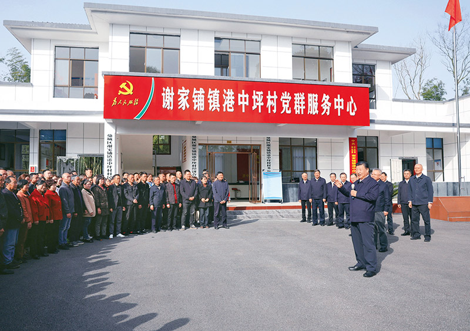
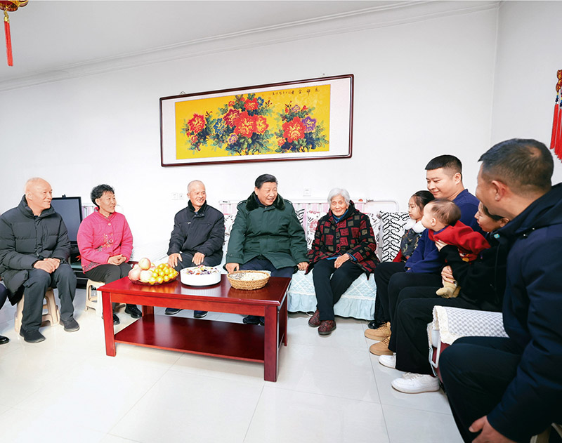
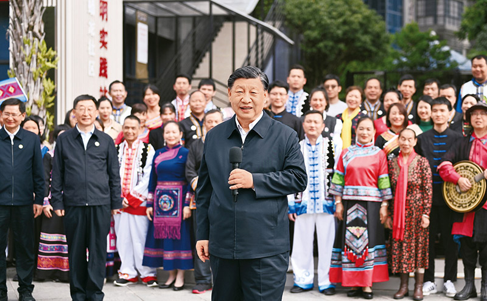

**必须坚持人民至上※**

习近平

**一**

　　我们的人民是伟大的人民。在漫长的历史进程中，中国人民依靠自己的勤劳、勇敢、智慧，开创了各民族和睦共处的美好家园，培育了历久弥新的优秀文化。我们的人民热爱生活，期盼有更好的教育、更稳定的工作、更满意的收入、更可靠的社会保障、更高水平的医疗卫生服务、更舒适的居住条件、更优美的环境，期盼孩子们能成长得更好、工作得更好、生活得更好。人民对美好生活的向往，就是我们的奋斗目标。人世间的一切幸福都需要靠辛勤的劳动来创造。我们的责任，就是要团结带领全党全国各族人民，继续解放思想，坚持改革开放，不断解放和发展社会生产力，努力解决群众的生产生活困难，坚定不移走共同富裕的道路。

　　（2012年11月15日在十八届中央政治局常委同中外记者见面时的讲话）

**二**

　　人民是历史的创造者，群众是真正的英雄。人民群众是我们力量的源泉。我们深深知道，每个人的力量是有限的，但只要我们万众一心、众志成城，就没有克服不了的困难；每个人的工作时间是有限的，但全心全意为人民服务是无限的。责任重于泰山，事业任重道远。我们一定要始终与人民心心相印、与人民同甘共苦、与人民团结奋斗，夙夜在公，勤勉工作，努力向历史、向人民交出一份合格的答卷。

　　（2012年11月15日在十八届中央政治局常委同中外记者见面时的讲话）

　　2024年3月18日至21日，中共中央总书记、国家主席、中央军委主席习近平在湖南考察。这是19日下午，习近平在常德市鼎城区谢家铺镇港中坪村考察时，同乡亲们亲切交流。 新华社记者 鞠鹏/摄

**三**

　　我们讲宗旨，讲了很多话，但说到底还是为人民服务这句话。我们党就是为人民服务的。中央的考虑，是要为人民做事。各级干部也不能眼睛总是向上。任何事情都要向上看看，向下看看。要经常问问自己，我们是不是在忙着与党的根本宗旨毫不相关的事情？有没有一心一意在为老百姓做事情？是不是在围绕党和国家中心任务而工作？古时候讲，食君之禄，忠君之事。现在就是要服务人民。

　　（2012年12月29日、30日在河北省阜平县考察扶贫开发工作时的讲话）

**四**

　　我们党来自人民、植根人民、服务人民，党的根基在人民、血脉在人民、力量在人民。失去了人民拥护和支持，党的事业和工作就无从谈起。党要继续经受住执政考验、改革开放考验、市场经济考验、外部环境考验，就必须始终密切联系群众。在任何时候任何情况下，与人民同呼吸共命运的立场不能变，全心全意为人民服务的宗旨不能忘，群众是真正英雄的历史唯物主义观点不能丢，始终坚持立党为公、执政为民。

　　（2013年6月18日在党的群众路线教育实践活动工作会议上的讲话）

**五**

　　群众路线本质上体现的是马克思主义关于人民群众是历史的创造者这一基本原理。只有坚持这一基本原理，我们才能把握历史前进的基本规律。只有按历史规律办事，我们才能无往而不胜。历史反复证明，人民群众是历史发展和社会进步的主体力量。正如毛泽东同志所说：“中国的命运一经操在人民自己的手里，中国就将如太阳升起在东方那样，以自己的辉煌的光焰普照大地”。

　　（2013年12月26日在纪念毛泽东同志诞辰120周年座谈会上的讲话）

　　2024年2月1日至2日，中共中央总书记、国家主席、中央军委主席习近平来到天津，看望慰问基层干部群众。这是1日上午，习近平在西青区辛口镇第六埠村考察时，同村民杜洪刚一家人亲切拉家常。 新华社记者 鞠鹏/摄

**六**

　　中国共产党的一切执政活动，中华人民共和国的一切治理活动，都要尊重人民主体地位，尊重人民首创精神，拜人民为师，把政治智慧的增长、治国理政本领的增强深深扎根于人民的创造性实践之中，使各方面提出的真知灼见都能运用于治国理政。

　　（2014年9月21日在庆祝中国人民政治协商会议成立65周年大会上的讲话）

**七**

　　发展为了人民，这是马克思主义政治经济学的根本立场。马克思、恩格斯指出：“无产阶级的运动是绝大多数人的、为绝大多数人谋利益的独立的运动”，在未来社会“生产将以所有的人富裕为目的”。邓小平同志指出，社会主义的本质，是解放生产力，发展生产力，消灭剥削，消除两极分化，最终达到共同富裕。党的十八届五中全会鲜明提出要坚持以人民为中心的发展思想，把增进人民福祉、促进人的全面发展、朝着共同富裕方向稳步前进作为经济发展的出发点和落脚点。这一点，我们任何时候都不能忘记，部署经济工作、制定经济政策、推动经济发展都要牢牢坚持这个根本立场。

　　（2015年11月23日在十八届中央政治局第二十八次集体学习时的讲话）

**八**

　　人民立场是中国共产党的根本政治立场，是马克思主义政党区别于其他政党的显著标志。党与人民风雨同舟、生死与共，始终保持血肉联系，是党战胜一切困难和风险的根本保证，正所谓“得众则得国，失众则失国”。

　　（2016年7月1日在庆祝中国共产党成立95周年大会上的讲话）

**九**

　　不忘初心，方得始终。中国共产党人的初心和使命，就是为中国人民谋幸福，为中华民族谋复兴。这个初心和使命是激励中国共产党人不断前进的根本动力。全党同志一定要永远与人民同呼吸、共命运、心连心，永远把人民对美好生活的向往作为奋斗目标，以永不懈怠的精神状态和一往无前的奋斗姿态，继续朝着实现中华民族伟大复兴的宏伟目标奋勇前进。

　　（2017年10月18日在中国共产党第十九次全国代表大会上的报告）

**十**

　　时代是出卷人，我们是答卷人，人民是阅卷人。

（2018年1月5日在新进中央委员会的委员、候补委员和省部级主要领导干部
学习贯彻习近平新时代中国特色社会主义思想和党的十九大精神研讨班上的讲话）

**十一**

　　人民是历史的创造者，人民是真正的英雄。波澜壮阔的中华民族发展史是中国人民书写的！博大精深的中华文明是中国人民创造的！历久弥新的中华民族精神是中国人民培育的！中华民族迎来了从站起来、富起来到强起来的伟大飞跃是中国人民奋斗出来的！

　　（2018年3月20日在第十三届全国人民代表大会第一次会议上的讲话）

**十二**

　　学习马克思，就要学习和实践马克思主义关于坚守人民立场的思想。人民性是马克思主义最鲜明的品格。马克思说，“历史活动是群众的活动”。让人民获得解放是马克思毕生的追求。我们要始终把人民立场作为根本立场，把为人民谋幸福作为根本使命，坚持全心全意为人民服务的根本宗旨，贯彻群众路线，尊重人民主体地位和首创精神，始终保持同人民群众的血肉联系，凝聚起众志成城的磅礴力量，团结带领人民共同创造历史伟业。这是尊重历史规律的必然选择，是共产党人不忘初心、牢记使命的自觉担当。

　　（2018年5月4日在纪念马克思诞辰200周年大会上的讲话）

**十三**

　　人民是我们党执政的最大底气，是我们共和国的坚实根基，是我们强党兴国的根本所在。我们党来自于人民，为人民而生，因人民而兴，必须始终与人民心心相印、与人民同甘共苦、与人民团结奋斗。每个共产党员都要弄明白，党除了人民利益之外没有自己的特殊利益，党的一切工作都是为了实现好、维护好、发展好最广大人民根本利益；人民是历史的创造者、人民是真正的英雄，必须相信人民、依靠人民；我们永远是劳动人民的普通一员，必须保持同人民群众的血肉联系。

　　（2019年5月31日在“不忘初心、牢记使命”主题教育工作会议上的讲话）

　　2023年12月14日至15日，中共中央总书记、国家主席、中央军委主席习近平在广西考察。这是14日上午，习近平在南宁市良庆区蟠龙社区考察时，同社区各族群众亲切交流。 新华社记者 燕雁/摄

**十四**

　　中国共产党根基在人民、血脉在人民。坚持以人民为中心的发展思想，体现了党的理想信念、性质宗旨、初心使命，也是对党的奋斗历程和实践经验的深刻总结。自成立以来，我们党团结带领人民进行革命、建设、改革，根本目的就是为了让人民过上好日子，无论面临多大挑战和压力，无论付出多大牺牲和代价，这一点都始终不渝、毫不动摇。坚持以人民为中心的发展思想，不是一句空洞口号，必须落实到各项决策部署和实际工作之中。

　　（2020年5月22日在参加十三届全国人大三次会议内蒙古代表团审议时的讲话）

**十五**

　　要把为民造福作为最重要的政绩。中国共产党把为民办事、为民造福作为最重要的政绩，把为老百姓办了多少好事实事作为检验政绩的重要标准。党员、干部特别是领导干部要清醒认识到，自己手中的权力、所处的岗位，是党和人民赋予的，是为党和人民做事用的，只能用来为民谋利。各级领导干部要树立正确的权力观、政绩观、事业观，不慕虚荣，不务虚功，不图虚名，切实做到为官一任、造福一方。

　　（2020年5月22日在参加十三届全国人大三次会议内蒙古代表团审议时的讲话）

**十六**

　　中国共产党是中国工人阶级的先锋队，同时是中国人民和中华民族的先锋队。党章也明确规定，党坚持全心全意为人民服务，在任何时候都把群众利益放在第一位，同群众同甘共苦，保持最密切的联系。这就要求我们必须坚持尊重社会发展规律和尊重人民历史主体地位的一致性、为崇高理想奋斗和为最广大人民谋利益的一致性、完成党的各项工作和实现人民利益的一致性，永不脱离群众，与群众有福同享、有难同当，有盐同咸、无盐同淡。

　　（2021年2月20日在党史学习教育动员大会上的讲话）

**十七**

　　江山就是人民、人民就是江山，打江山、守江山，守的是人民的心。中国共产党根基在人民、血脉在人民、力量在人民。中国共产党始终代表最广大人民根本利益，与人民休戚与共、生死相依，没有任何自己特殊的利益，从来不代表任何利益集团、任何权势团体、任何特权阶层的利益。

　　（2021年7月1日在庆祝中国共产党成立100周年大会上的讲话）

**十八**

　　必须坚持人民至上。人民性是马克思主义的本质属性，党的理论是来自人民、为了人民、造福人民的理论，人民的创造性实践是理论创新的不竭源泉。一切脱离人民的理论都是苍白无力的，一切不为人民造福的理论都是没有生命力的。我们要站稳人民立场、把握人民愿望、尊重人民创造、集中人民智慧，形成为人民所喜爱、所认同、所拥有的理论，使之成为指导人民认识世界和改造世界的强大思想武器。

　　（2022年10月16日在中国共产党第二十次全国代表大会上的报告）

**十九**

　　新征程上，我们要始终坚持一切为了人民、一切依靠人民。一路走来，我们紧紧依靠人民交出了一份又一份载入史册的答卷。面向未来，我们仍然要依靠人民创造新的历史伟业。

　　道阻且长，行则将至。前进道路上，无论是风高浪急还是惊涛骇浪，人民永远是我们最坚实的依托、最强大的底气。我们要始终与人民风雨同舟、与人民心心相印，想人民之所想，行人民之所嘱，不断把人民对美好生活的向往变为现实。

　　（2022年10月23日在二十届中央政治局常委同中外记者见面时的讲话）

**二十**

　　我们党深刻认识到中国式现代化是亿万人民自己的事业，人民是中国式现代化的主体，必须紧紧依靠人民，尊重人民创造精神，汇集全体人民的智慧和力量，才能推动中国式现代化不断向前发展。我们坚持党的群众路线，想问题、作决策、办事情注重把准人民脉搏、回应人民关切、体现人民愿望、增进人民福祉，努力使党的理论和路线方针政策得到人民群众衷心拥护。我们坚持把人民对美好生活的向往作为奋斗目标，坚持以人民为中心的发展思想，着力保障和改善民生，着力解决人民急难愁盼问题，让中国式现代化建设成果更多更公平地惠及全体人民。我们党发展全过程人民民主，拓展民主渠道，丰富民主形式，扩大人民有序政治参与，确保人民依法通过各种途径和形式管理国家事务，管理经济和文化事业，管理社会事务，以主人翁精神满怀热忱地投入到现代化建设中来。我们党以中国式现代化的美好愿景激励人、鼓舞人、感召人，有效促进政党关系、民族关系、宗教关系、阶层关系、海内外同胞关系和谐，促进海内外中华儿女团结奋斗，凝聚起全面建设社会主义现代化国家的磅礴伟力。

（2023年2月7日在新进中央委员会的委员、候补委员和省部级主要领导干部
学习贯彻习近平新时代中国特色社会主义思想和党的二十大精神研讨班上的讲话）

**二十一**

　　我们要始终坚持人民至上。全面建成社会主义现代化强国，人民是决定性力量。要积极发展全过程人民民主，坚持党的领导、人民当家作主、依法治国有机统一，健全人民当家作主制度体系，实现人民意志，保障人民权益，充分激发全体人民的积极性主动性创造性。要贯彻以人民为中心的发展思想，完善分配制度，健全社会保障体系，强化基本公共服务，兜牢民生底线，解决好人民群众急难愁盼问题，让现代化建设成果更多更公平惠及全体人民，在推进全体人民共同富裕上不断取得更为明显的实质性进展。要不断巩固发展全国各族人民大团结、海内外中华儿女大团结，充分调动一切积极因素，凝聚起强国建设、民族复兴的磅礴力量。

　　（2023年3月13日在第十四届全国人民代表大会第一次会议上的讲话）

　　2023年11月28日至12月2日，中共中央总书记、国家主席、中央军委主席习近平在上海考察。这是11月29日下午，习近平在闵行区新时代城市建设者管理者之家考察时，在社区宿舍型出租房源租户的住房，了解在此居住的城市一线工作者的生活状况。 新华社记者 鞠鹏/摄

**二十二**

　　我们要坚守人民至上理念，突出现代化方向的人民性。人民是历史的创造者，是推进现代化最坚实的根基、最深厚的力量。现代化的最终目标是实现人自由而全面的发展。现代化道路最终能否走得通、行得稳，关键要看是否坚持以人民为中心。现代化不仅要看纸面上的指标数据，更要看人民的幸福安康。政党要锚定人民对美好生活的向往，顺应人民对文明进步的渴望，努力实现物质富裕、政治清明、精神富足、社会安定、生态宜人，让现代化更好回应人民各方面诉求和多层次需要，既增进当代人福祉，又保障子孙后代权益，促进人类社会可持续发展。

　　（2023年3月15日在中国共产党与世界政党高层对话会上的主旨讲话）

**二十三**

　　马克思主义中国化时代化成果，都是党和人民实践经验和集体智慧的结晶。无论是毛泽东思想、中国特色社会主义理论体系，还是新时代中国特色社会主义思想，无不源自于人民的智慧、人民的探索、人民的创造。人民群众身处实践最前沿，对实践变化感知最敏感、感受最深切，也最聪慧，只要走到人民群众中去，很多百思不得其解的问题就能豁然开朗、找到答案。我们的各项工作实践要走好群众路线，推进党的理论创新也要走好群众路线，决不能闭门造车、坐而论道、流于空想。在谋划这次主题教育时，我提出大兴调查研究，就是要推动各级领导干部树牢唯物史观，强化群众观点和宗旨意识，坚持目标导向和问题导向，走出机关沉到基层一线，广泛倾听人民群众的声音，自觉问计于民、问需于民，运用党的创新理论研究解决好发展所需、改革所急、基层所盼、民心所向的突出问题，同时从人民群众的真知灼见中获取理论创新和实践创新灵感。要尊重人民首创精神，注重从人民的创造性实践中总结新鲜经验，上升为理性认识，提炼出新的理论成果，着力让党的创新理论深入亿万人民心中，成为接地气、聚民智、顺民意、得民心的理论。

　　（2023年6月30日在二十届中央政治局第六次集体学习时的讲话）

**二十四**

　　团结奋斗是党领导人民创造历史伟业的必由之路。团结奋斗要靠目标凝心聚力，新征程上我们就要靠中国式现代化进一步凝心聚力、团结奋斗。中国式现代化是全体人民的共同事业，也是一项充满风险挑战、需要付出艰辛努力的宏伟事业，必须坚持全体人民共同参与、共同建设、共同享有，紧紧依靠全体人民和衷共济、共襄大业。

（2023年12月21日、22日在中央政治局学习贯彻
习近平新时代中国特色社会主义思想主题教育专题民主生活会上的讲话）

**二十五**

　　要充分激发全体人民的历史主动精神。人民，只有人民，才是创造世界历史的动力。中国式现代化是全体中国人民的事业，必须紧紧依靠人民，汇聚蕴藏在人民中的无穷智慧和力量，才能不断创造新的历史伟业。我们要坚持人民是创造历史根本动力的历史唯物主义基本观点，坚持人民主体地位，充分尊重人民所表达的意愿、所创造的经验、所拥有的权利、所发挥的作用，把维护好、实现好、发展好最广大人民根本利益作为一切工作的出发点和落脚点，让现代化建设成果更多更公平惠及全体人民。

　　（2023年12月26日在纪念毛泽东同志诞辰130周年座谈会上的讲话）

　　※这是习近平总书记2012年11月至2023年12月期间有关必须坚持人民至上重要论述的节录。